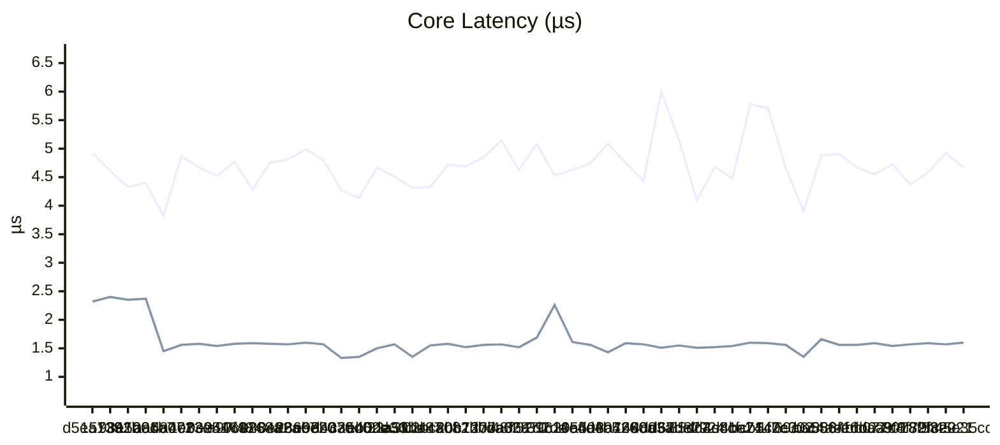
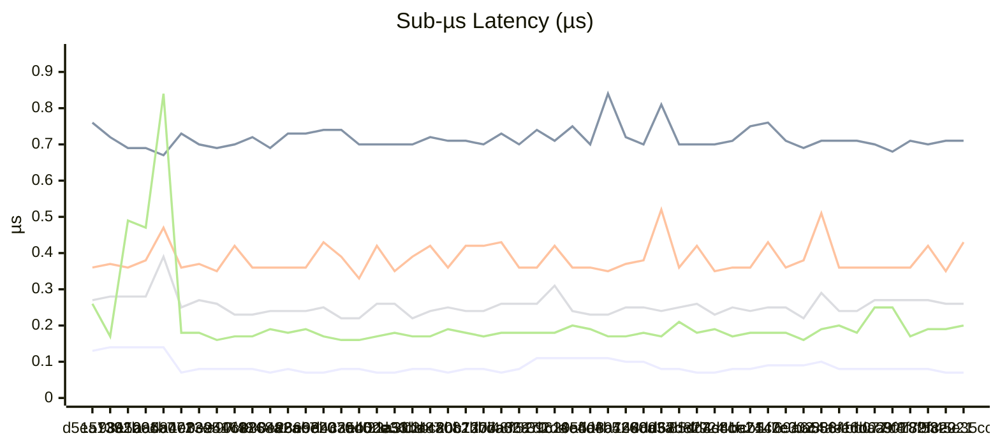
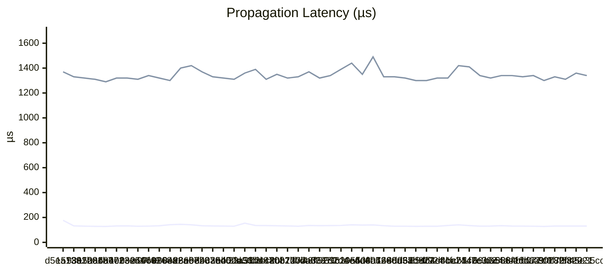
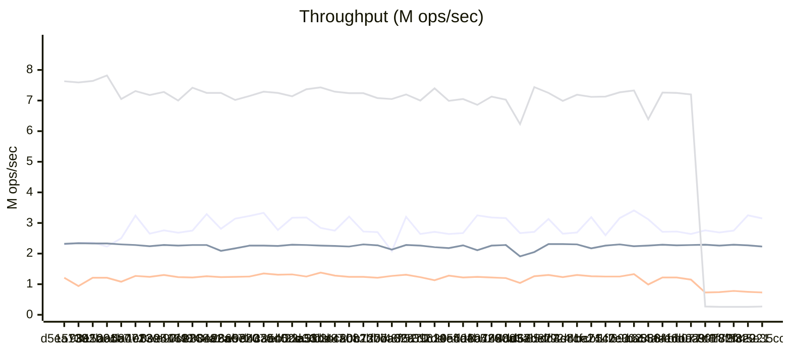
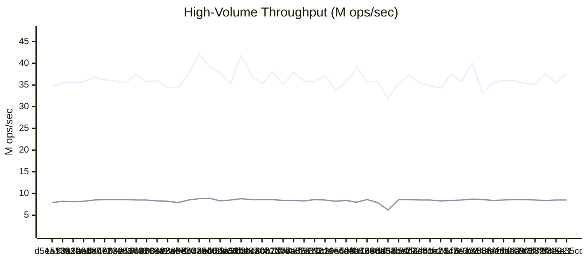
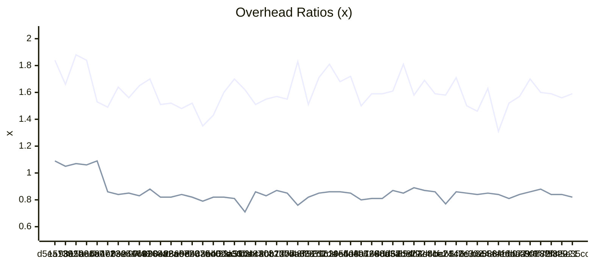

# Benchmark History

> Auto-generated by CI. Last updated: 2026-03-04T00:46:31Z
>
> Tracks the last 50 runs. Oldest entries are pruned automatically.

## Legend

| Symbol | Meaning |
|--------|---------|
| ▲ | Regression (>5% worse) |
| ▼ | Improvement (>5% better) |
| ≈ | Within 5% of previous |

## Latest Run

| Metric | Value |
|--------|-------|
| Node Creation (100K) | 0.07 µs/node ▲ |
| Notification Throughput | 3.15M mutations/sec ≈ |
| Batch Speedup | 1.59x ≈ |
| Deep Chain (1000) | 130.96 µs/propagation ≈ |
| Fan-Out (10K) | 1.34ms ≈ |
| Herald Throughput (10 listeners) | 2.23M events/sec ≈ |
| Pillar Lifecycle (10K) | 4.67 µs/pillar ▼ |
| Diamond Pattern (1K) | 0.71 µs/diamond ≈ |
| Epoch Overhead | 0.82x ≈ |
| Vigil Capture | 8.52M captures/sec ≈ |
| Loom Transition (30K) | 0.43 µs/transition ▲ |
| Sigil Lookup (1M) | 37.77M lookups/sec ▼ |
| Annals Record (100K, cap=1K) | 271.5K records/sec ≈ |
| Tether Call (10K) | 730.7K calls/sec ≈ |
| Conduit Pipeline (10K) | 0.26 µs/set ≈ |
| Prism Projection (10K) | 1.60 µs/projection ≈ |
| Nexus List Add (10K) | 0.20 µs/add ≈ |
| Refresh Full Cycle (50K) | 1.74 µs/refresh ≈ |
| Banner Lookup (100 flags, 100K) | 0.18 µs/op ≈ |
| Sieve Filter (10K items, 1K) | 266.91 µs/op ≈ |
| Lattice Diamond (4 nodes, 1K) | 61.57 µs/op ▼ |
| Embargo MutexGuard (1K) | 2.88 µs/op ≈ |
| Census Record (10K) | 4.28 µs/op ≈ |
| Warden CheckService (1K) | 1.85 µs/op ≈ |
| Arbiter Submit+Resolve LWW (10K) | 14.96 µs/op ≈ |
| Lode Acquire+Release (10K) | 0.85 µs/op ≈ |
| Tithe Consume (100K) | 0.05 µs/op ▲ |
| Sluice Feed+Flush 1-stage (100K) | 0.76 µs/op ≈ |
| Clarion Trigger (100K) | 0.08 µs/op ≈ |
| Tapestry Append+Weave (100K) | 0.38 µs/op ≈ |

## History

| Date | Commit | Dart | Node Creation (100K) | Notification Throughput | Batch Speedup | Deep Chain (1000) | Fan-Out (10K) | Herald Throughput (10 listeners) | Pillar Lifecycle (10K) | Diamond Pattern (1K) | Epoch Overhead | Vigil Capture | Loom Transition (30K) | Sigil Lookup (1M) | Annals Record (100K, cap=1K) | Tether Call (10K) | Conduit Pipeline (10K) | Prism Projection (10K) | Nexus List Add (10K) | Refresh Full Cycle (50K) | Banner Lookup (100 flags, 100K) | Sieve Filter (10K items, 1K) | Lattice Diamond (4 nodes, 1K) | Embargo MutexGuard (1K) | Census Record (10K) | Warden CheckService (1K) | Arbiter Submit+Resolve LWW (10K) | Lode Acquire+Release (10K) | Tithe Consume (100K) | Sluice Feed+Flush 1-stage (100K) | Clarion Trigger (100K) | Tapestry Append+Weave (100K) |
| --- | --- | --- | --- | --- | --- | --- | --- | --- | --- | --- | --- | --- | --- | --- | --- | --- | --- | --- | --- | --- | --- | --- | --- | --- | --- | --- | --- | --- | --- | --- | --- | --- |
| 2026-03-04 00:46 | 45e35cc | 3.11.0 | 0.07 µs/node ▲ | 3.15M mutations/sec ≈ | 1.59x ≈ | 130.96 µs/propagation ≈ | 1.34ms ≈ | 2.23M events/sec ≈ | 4.67 µs/pillar ▼ | 0.71 µs/diamond ≈ | 0.82x ≈ | 8.52M captures/sec ≈ | 0.43 µs/transition ▲ | 37.77M lookups/sec ▼ | 271.5K records/sec ≈ | 730.7K calls/sec ≈ | 0.26 µs/set ≈ | 1.60 µs/projection ≈ | 0.20 µs/add ≈ | 1.74 µs/refresh ≈ | 0.18 µs/op ≈ | 266.91 µs/op ≈ | 61.57 µs/op ▼ | 2.88 µs/op ≈ | 4.28 µs/op ≈ | 1.85 µs/op ≈ | 14.96 µs/op ≈ | 0.85 µs/op ≈ | 0.05 µs/op ▲ | 0.76 µs/op ≈ | 0.08 µs/op ≈ | 0.38 µs/op ≈ |
| 2026-03-04 00:31 | 9fce221 | 3.11.0 | 0.07 µs/node ▼ | 3.25M mutations/sec ▼ | 1.56x ≈ | 130.73 µs/propagation ≈ | 1.36ms ≈ | 2.27M events/sec ≈ | 4.92 µs/pillar ▲ | 0.71 µs/diamond ≈ | 0.84x ≈ | 8.47M captures/sec ≈ | 0.35 µs/transition ▼ | 35.51M lookups/sec ▲ | 260.2K records/sec ≈ | 745.9K calls/sec ≈ | 0.26 µs/set ≈ | 1.57 µs/projection ≈ | 0.19 µs/add ≈ | 1.73 µs/refresh ≈ | 0.18 µs/op ≈ | 269.78 µs/op ≈ | 69.87 µs/op ▲ | 2.79 µs/op ▼ | 4.27 µs/op ≈ | 1.79 µs/op ≈ | 15.24 µs/op ≈ | 0.85 µs/op ▼ | 0.05 µs/op ▲ | 0.76 µs/op ≈ | 0.08 µs/op ≈ | 0.38 µs/op ≈ |
| 2026-03-03 23:41 | 782f820 | 3.11.0 | 0.08 µs/node ≈ | 2.75M mutations/sec ≈ | 1.59x ≈ | 131.19 µs/propagation ≈ | 1.31ms ≈ | 2.29M events/sec ≈ | 4.58 µs/pillar ≈ | 0.70 µs/diamond ≈ | 0.84x ≈ | 8.40M captures/sec ≈ | 0.42 µs/transition ▲ | 37.53M lookups/sec ▼ | 260.8K records/sec ≈ | 775.5K calls/sec ≈ | 0.27 µs/set ≈ | 1.59 µs/projection ≈ | 0.19 µs/add ▲ | 1.71 µs/refresh ≈ | 0.18 µs/op ≈ | 264.92 µs/op ≈ | 61.52 µs/op ≈ | 2.96 µs/op ≈ | 4.45 µs/op ≈ | 1.76 µs/op ≈ | 14.73 µs/op ≈ | 0.96 µs/op ▲ | 0.05 µs/op ▲ | 0.79 µs/op ▲ | 0.08 µs/op ▲ | 0.38 µs/op ▲ |
| 2026-03-03 23:31 | 8018f53 | 3.11.0 | 0.08 µs/node ≈ | 2.69M mutations/sec ≈ | 1.60x ▲ | 130.80 µs/propagation ≈ | 1.33ms ≈ | 2.26M events/sec ≈ | 4.37 µs/pillar ▼ | 0.71 µs/diamond ≈ | 0.88x ≈ | 8.49M captures/sec ≈ | 0.36 µs/transition ≈ | 35.24M lookups/sec ≈ | 260.1K records/sec ≈ | 738.6K calls/sec ≈ | 0.27 µs/set ≈ | 1.57 µs/projection ≈ | 0.17 µs/add ▼ | 1.72 µs/refresh ≈ | 0.18 µs/op ▼ | 265.17 µs/op ≈ | 59.37 µs/op ≈ | 2.98 µs/op ≈ | 4.29 µs/op ▼ | 1.78 µs/op ≈ | 14.71 µs/op ▼ | 0.84 µs/op ≈ | 0.05 µs/op ▲ | 0.73 µs/op ▼ | 0.07 µs/op ▼ | 0.36 µs/op ▼ |
| 2026-03-03 23:23 | aa9f8f7 | 3.11.0 | 0.08 µs/node ≈ | 2.76M mutations/sec ≈ | 1.70x ▼ | 127.97 µs/propagation ≈ | 1.30ms ≈ | 2.29M events/sec ≈ | 4.73 µs/pillar ≈ | 0.68 µs/diamond ≈ | 0.86x ≈ | 8.63M captures/sec ≈ | 0.36 µs/transition ≈ | 35.39M lookups/sec ≈ | 270.1K records/sec ▲ | 727.5K calls/sec ▲ | 0.27 µs/set ≈ | 1.54 µs/projection ≈ | 0.25 µs/add ≈ | 1.71 µs/refresh ≈ | 0.19 µs/op ▲ | 263.22 µs/op ≈ | 59.95 µs/op ▲ | 2.90 µs/op ≈ | 5.04 µs/op ▲ | 1.85 µs/op ▼ | 16.07 µs/op ▲ | 0.85 µs/op ▲ | 0.05 µs/op ▲ | 0.79 µs/op ▼ | 0.08 µs/op ≈ | 0.39 µs/op ≈ |
| 2026-03-03 23:04 | bb077c4 | 3.11.0 | 0.08 µs/node ≈ | 2.64M mutations/sec ≈ | 1.57x ≈ | 129.85 µs/propagation ≈ | 1.34ms ≈ | 2.28M events/sec ≈ | 4.55 µs/pillar ≈ | 0.70 µs/diamond ≈ | 0.84x ≈ | 8.60M captures/sec ≈ | 0.36 µs/transition ≈ | 35.98M lookups/sec ≈ | 7.20M records/sec ≈ | 1.15M calls/sec ▲ | 0.27 µs/set ▲ | 1.59 µs/projection ≈ | 0.25 µs/add ▲ | 1.70 µs/refresh ≈ | 0.17 µs/op ≈ | 265.20 µs/op ≈ | 52.07 µs/op ≈ | 2.95 µs/op ▲ | 4.09 µs/op ≈ | 1.95 µs/op ≈ | 14.26 µs/op ≈ | 0.77 µs/op ≈ | 0.05 µs/op ≈ | 0.84 µs/op ≈ | 0.08 µs/op ≈ | 0.39 µs/op |
| 2026-03-03 22:57 | fe1db02 | 3.11.0 | 0.08 µs/node ≈ | 2.72M mutations/sec ≈ | 1.52x ▼ | 130.53 µs/propagation ≈ | 1.33ms ≈ | 2.27M events/sec ≈ | 4.67 µs/pillar ≈ | 0.71 µs/diamond ≈ | 0.81x ≈ | 8.54M captures/sec ≈ | 0.36 µs/transition ≈ | 36.02M lookups/sec ≈ | 7.25M records/sec ≈ | 1.22M calls/sec ≈ | 0.24 µs/set ≈ | 1.56 µs/projection ≈ | 0.18 µs/add ▼ | 1.72 µs/refresh ≈ | 0.18 µs/op ≈ | 263.15 µs/op ≈ | 50.71 µs/op ≈ | 2.74 µs/op ≈ | 4.18 µs/op ≈ | 1.99 µs/op ≈ | 14.67 µs/op ≈ | 0.78 µs/op ≈ | 0.05 µs/op ≈ | 0.85 µs/op ≈ | 0.08 µs/op | - |
| 2026-03-03 22:47 | 883fe6d | 3.11.0 | 0.08 µs/node ▼ | 2.71M mutations/sec ▲ | 1.31x ▲ | 131.00 µs/propagation ≈ | 1.34ms ≈ | 2.29M events/sec ≈ | 4.91 µs/pillar ≈ | 0.71 µs/diamond ≈ | 0.84x ≈ | 8.38M captures/sec ≈ | 0.36 µs/transition ▼ | 35.56M lookups/sec ▼ | 7.26M records/sec ▼ | 1.22M calls/sec ▼ | 0.24 µs/set ▼ | 1.56 µs/projection ▼ | 0.20 µs/add ▲ | 1.69 µs/refresh ▼ | 0.17 µs/op ≈ | 266.54 µs/op ≈ | 49.83 µs/op ≈ | 2.73 µs/op ▼ | 4.21 µs/op ▼ | 1.97 µs/op ▼ | 14.33 µs/op ▼ | 0.79 µs/op ≈ | 0.05 µs/op ≈ | 0.83 µs/op | - | - |
| 2026-03-03 22:35 | ba5564f | 3.11.0 | 0.10 µs/node ▲ | 3.12M mutations/sec ▲ | 1.63x ▼ | 134.30 µs/propagation ≈ | 1.34ms ≈ | 2.26M events/sec ≈ | 4.88 µs/pillar ▲ | 0.71 µs/diamond ≈ | 0.85x ≈ | 8.61M captures/sec ≈ | 0.51 µs/transition ▲ | 33.13M lookups/sec ▲ | 6.39M records/sec ▲ | 990.0K calls/sec ▲ | 0.29 µs/set ▲ | 1.66 µs/projection ▲ | 0.19 µs/add ▲ | 1.78 µs/refresh ▲ | 0.18 µs/op ≈ | 267.75 µs/op ≈ | 51.27 µs/op ≈ | 4.15 µs/op ▲ | 4.62 µs/op ▲ | 2.13 µs/op ▲ | 15.87 µs/op ▲ | 0.83 µs/op ▲ | 0.05 µs/op | - | - | - |
| 2026-03-03 22:26 | 69a6c4a | 3.11.0 | 0.09 µs/node ≈ | 3.41M mutations/sec ▼ | 1.46x ≈ | 130.73 µs/propagation ≈ | 1.32ms ≈ | 2.24M events/sec ≈ | 3.90 µs/pillar ▼ | 0.69 µs/diamond ≈ | 0.84x ≈ | 8.66M captures/sec ≈ | 0.38 µs/transition ▲ | 40.10M lookups/sec ▼ | 7.33M records/sec ≈ | 1.33M calls/sec ▼ | 0.22 µs/set ▼ | 1.35 µs/projection ▼ | 0.16 µs/add ▼ | 1.61 µs/refresh ≈ | 0.17 µs/op ≈ | 276.89 µs/op ≈ | 49.97 µs/op ▲ | 2.77 µs/op ▼ | 2.64 µs/op ▼ | 1.76 µs/op ▼ | 8.08 µs/op ▼ | 0.72 µs/op | - | - | - | - |
| 2026-03-03 22:16 | 1f7e002 | 3.11.0 | 0.09 µs/node ≈ | 3.16M mutations/sec ▼ | 1.50x ▲ | 129.88 µs/propagation ≈ | 1.34ms ▼ | 2.30M events/sec ≈ | 4.66 µs/pillar ▼ | 0.71 µs/diamond ▼ | 0.85x ≈ | 8.53M captures/sec ≈ | 0.36 µs/transition ▼ | 35.76M lookups/sec ≈ | 7.27M records/sec ≈ | 1.25M calls/sec ≈ | 0.25 µs/set ≈ | 1.56 µs/projection ≈ | 0.18 µs/add ≈ | 1.65 µs/refresh ≈ | 0.17 µs/op ≈ | 264.32 µs/op ≈ | 46.54 µs/op ▼ | 2.99 µs/op ▲ | 4.17 µs/op ≈ | 1.94 µs/op ▼ | 14.23 µs/op | - | - | - | - | - |
| 2026-03-03 22:09 | cb5c0c3 | 3.11.0 | 0.09 µs/node ▲ | 2.60M mutations/sec ▲ | 1.71x ▼ | 135.07 µs/propagation ≈ | 1.41ms ≈ | 2.26M events/sec ≈ | 5.71 µs/pillar ≈ | 0.76 µs/diamond ≈ | 0.86x ▼ | 8.36M captures/sec ≈ | 0.43 µs/transition ▲ | 37.39M lookups/sec ▼ | 7.13M records/sec ≈ | 1.25M calls/sec ≈ | 0.25 µs/set ≈ | 1.59 µs/projection ≈ | 0.18 µs/add ≈ | 1.73 µs/refresh ▲ | 0.18 µs/op ≈ | 264.77 µs/op ≈ | 50.27 µs/op ▲ | 2.81 µs/op ▼ | 4.26 µs/op ▼ | 2.06 µs/op | - | - | - | - | - | - |
| 2026-03-03 21:59 | 4ba7142 | 3.11.0 | 0.08 µs/node ▼ | 3.19M mutations/sec ▼ | 1.58x ≈ | 140.66 µs/propagation ≈ | 1.42ms ▲ | 2.17M events/sec ▲ | 5.78 µs/pillar ▲ | 0.75 µs/diamond ▲ | 0.77x ▲ | 8.30M captures/sec ≈ | 0.36 µs/transition ≈ | 34.29M lookups/sec ≈ | 7.12M records/sec ≈ | 1.26M calls/sec ≈ | 0.24 µs/set ≈ | 1.60 µs/projection ≈ | 0.18 µs/add ▲ | 1.64 µs/refresh ≈ | 0.18 µs/op ≈ | 276.55 µs/op ≈ | 39.31 µs/op ▼ | 6.47 µs/op ▲ | 4.73 µs/op | - | - | - | - | - | - | - |
| 2026-03-03 21:50 | 3e81e24 | 3.11.0 | 0.08 µs/node ▲ | 2.69M mutations/sec ≈ | 1.59x ▲ | 135.70 µs/propagation ≈ | 1.32ms ≈ | 2.30M events/sec ≈ | 4.48 µs/pillar ≈ | 0.71 µs/diamond ≈ | 0.86x ≈ | 8.54M captures/sec ≈ | 0.36 µs/transition ≈ | 34.76M lookups/sec ≈ | 7.19M records/sec ≈ | 1.30M calls/sec ▼ | 0.25 µs/set ▲ | 1.54 µs/projection ≈ | 0.17 µs/add ▼ | 1.68 µs/refresh ≈ | 0.18 µs/op ▲ | 265.67 µs/op ≈ | 45.67 µs/op ≈ | 4.97 µs/op | - | - | - | - | - | - | - | - |
| 2026-03-03 21:43 | fd4dccf | 3.11.0 | 0.07 µs/node ≈ | 2.65M mutations/sec ▲ | 1.69x ▼ | 129.52 µs/propagation ≈ | 1.32ms ≈ | 2.31M events/sec ≈ | 4.68 µs/pillar ▲ | 0.70 µs/diamond ≈ | 0.87x ≈ | 8.53M captures/sec ≈ | 0.35 µs/transition ▼ | 35.54M lookups/sec ≈ | 6.99M records/sec ≈ | 1.23M calls/sec ▲ | 0.23 µs/set ▼ | 1.52 µs/projection ≈ | 0.19 µs/add ▲ | 1.70 µs/refresh ≈ | 0.17 µs/op ≈ | 266.48 µs/op ≈ | 44.53 µs/op | - | - | - | - | - | - | - | - | - |
| 2026-03-03 21:28 | 85df924 | 3.11.0 | 0.07 µs/node ▼ | 3.13M mutations/sec ▼ | 1.58x ▲ | 129.29 µs/propagation ≈ | 1.30ms ≈ | 2.31M events/sec ▼ | 4.09 µs/pillar ▼ | 0.70 µs/diamond ≈ | 0.89x ≈ | 8.56M captures/sec ≈ | 0.42 µs/transition ▲ | 37.32M lookups/sec ▼ | 7.25M records/sec ≈ | 1.30M calls/sec ≈ | 0.26 µs/set ≈ | 1.51 µs/projection ≈ | 0.18 µs/add ▼ | 1.70 µs/refresh ≈ | 0.18 µs/op ≈ | 266.68 µs/op | - | - | - | - | - | - | - | - | - | - |
| 2026-03-03 21:19 | d68d827 | 3.11.0 | 0.08 µs/node ≈ | 2.71M mutations/sec ≈ | 1.81x ▼ | 128.49 µs/propagation ≈ | 1.30ms ≈ | 2.05M events/sec ▼ | 5.15 µs/pillar ▼ | 0.70 µs/diamond ▼ | 0.85x ≈ | 8.60M captures/sec ▼ | 0.36 µs/transition ▼ | 35.43M lookups/sec ▼ | 7.44M records/sec ▼ | 1.26M calls/sec ▼ | 0.25 µs/set ▲ | 1.55 µs/projection ≈ | 0.21 µs/add ▲ | 1.71 µs/refresh ▼ | 0.17 µs/op | - | - | - | - | - | - | - | - | - | - | - |
| 2026-03-03 21:05 | 4dd57be | 3.11.0 | 0.08 µs/node ▼ | 2.67M mutations/sec ▲ | 1.61x ≈ | 129.75 µs/propagation ≈ | 1.32ms ≈ | 1.91M events/sec ▲ | 6.00 µs/pillar ▲ | 0.81 µs/diamond ▲ | 0.87x ▼ | 6.21M captures/sec ▲ | 0.52 µs/transition ▲ | 31.82M lookups/sec ▲ | 6.23M records/sec ▲ | 1.04M calls/sec ▲ | 0.24 µs/set ▼ | 1.51 µs/projection ≈ | 0.17 µs/add ≈ | 2.01 µs/refresh ▲ | - | - | - | - | - | - | - | - | - | - | - | - |
| 2026-03-03 15:33 | 148803a | 3.11.0 | 0.10 µs/node ≈ | 3.16M mutations/sec ≈ | 1.59x ≈ | 129.79 µs/propagation ≈ | 1.33ms ≈ | 2.28M events/sec ≈ | 4.43 µs/pillar ▼ | 0.70 µs/diamond ≈ | 0.81x ≈ | 7.93M captures/sec ▲ | 0.38 µs/transition ≈ | 35.79M lookups/sec ≈ | 7.03M records/sec ≈ | 1.20M calls/sec ≈ | 0.25 µs/set ≈ | 1.57 µs/projection ≈ | 0.18 µs/add ▲ | 1.72 µs/refresh ≈ | - | - | - | - | - | - | - | - | - | - | - | - |
| 2026-03-02 22:29 | 8a7690a | 3.11.0 | 0.10 µs/node ▼ | 3.18M mutations/sec ≈ | 1.59x ▼ | 133.68 µs/propagation ≈ | 1.33ms ▼ | 2.26M events/sec ▼ | 4.75 µs/pillar ▼ | 0.72 µs/diamond ▼ | 0.81x ≈ | 8.57M captures/sec ▼ | 0.37 µs/transition ≈ | 35.77M lookups/sec ▲ | 7.13M records/sec ≈ | 1.22M calls/sec ≈ | 0.25 µs/set ▲ | 1.59 µs/projection ▲ | 0.17 µs/add ≈ | 1.69 µs/refresh ≈ | - | - | - | - | - | - | - | - | - | - | - | - |
| 2026-03-02 22:26 | dae0426 | 3.11.0 | 0.11 µs/node ≈ | 3.25M mutations/sec ▼ | 1.50x ▲ | 140.51 µs/propagation ≈ | 1.49ms ▲ | 2.11M events/sec ▲ | 5.09 µs/pillar ▲ | 0.84 µs/diamond ▲ | 0.80x ▲ | 7.99M captures/sec ▲ | 0.35 µs/transition ≈ | 39.14M lookups/sec ▼ | 6.86M records/sec ≈ | 1.24M calls/sec ≈ | 0.23 µs/set ≈ | 1.43 µs/projection ▼ | 0.17 µs/add ▼ | 1.75 µs/refresh ≈ | - | - | - | - | - | - | - | - | - | - | - | - |
| 2026-03-02 22:16 | 4e4d4b5 | 3.11.0 | 0.11 µs/node ≈ | 2.67M mutations/sec ≈ | 1.72x ≈ | 138.83 µs/propagation ≈ | 1.35ms ▼ | 2.27M events/sec ≈ | 4.74 µs/pillar ≈ | 0.70 µs/diamond ▼ | 0.85x ≈ | 8.43M captures/sec ≈ | 0.36 µs/transition ≈ | 35.72M lookups/sec ▼ | 7.05M records/sec ≈ | 1.22M calls/sec ≈ | 0.23 µs/set ≈ | 1.56 µs/projection ≈ | 0.19 µs/add ▼ | 1.70 µs/refresh ≈ | - | - | - | - | - | - | - | - | - | - | - | - |
| 2026-03-02 22:08 | c20a50f | 3.11.0 | 0.11 µs/node ≈ | 2.64M mutations/sec ≈ | 1.68x ▲ | 140.97 µs/propagation ≈ | 1.44ms ≈ | 2.18M events/sec ≈ | 4.63 µs/pillar ≈ | 0.75 µs/diamond ▲ | 0.86x ≈ | 8.20M captures/sec ≈ | 0.36 µs/transition ▼ | 33.78M lookups/sec ▲ | 6.99M records/sec ▲ | 1.28M calls/sec ▼ | 0.24 µs/set ▼ | 1.61 µs/projection ▼ | 0.20 µs/add ▲ | 1.69 µs/refresh ≈ | - | - | - | - | - | - | - | - | - | - | - | - |
| 2026-03-02 21:49 | 396195f | 3.11.0 | 0.11 µs/node ≈ | 2.71M mutations/sec ≈ | 1.81x ▼ | 135.99 µs/propagation ≈ | 1.39ms ≈ | 2.21M events/sec ≈ | 4.53 µs/pillar ▼ | 0.71 µs/diamond ≈ | 0.86x ≈ | 8.50M captures/sec ≈ | 0.42 µs/transition ▲ | 37.17M lookups/sec ≈ | 7.40M records/sec ▼ | 1.13M calls/sec ▲ | 0.31 µs/set ▲ | 2.26 µs/projection ▲ | 0.18 µs/add ≈ | 1.71 µs/refresh ≈ | - | - | - | - | - | - | - | - | - | - | - | - |
| 2026-03-02 21:41 | 752d2de | 3.11.0 | 0.11 µs/node ▲ | 2.64M mutations/sec ▲ | 1.71x ▼ | 134.56 µs/propagation ≈ | 1.34ms ≈ | 2.26M events/sec ≈ | 5.08 µs/pillar ▲ | 0.74 µs/diamond ▲ | 0.85x ≈ | 8.58M captures/sec ≈ | 0.36 µs/transition ≈ | 35.74M lookups/sec ≈ | 7.00M records/sec ≈ | 1.23M calls/sec ▲ | 0.26 µs/set ≈ | 1.69 µs/projection ▲ | 0.18 µs/add ≈ | 1.73 µs/refresh ▼ | - | - | - | - | - | - | - | - | - | - | - | - |
| 2026-03-02 21:35 | 48f6a70 | 3.11.0 | 0.08 µs/node ▲ | 3.20M mutations/sec ▼ | 1.51x ▲ | 134.35 µs/propagation ≈ | 1.32ms ≈ | 2.28M events/sec ▼ | 4.63 µs/pillar ▼ | 0.70 µs/diamond ≈ | 0.82x ▼ | 8.29M captures/sec ≈ | 0.36 µs/transition ▼ | 35.91M lookups/sec ▲ | 7.20M records/sec ≈ | 1.31M calls/sec ≈ | 0.26 µs/set ≈ | 1.52 µs/projection ≈ | 0.18 µs/add ≈ | 1.89 µs/refresh ▲ | - | - | - | - | - | - | - | - | - | - | - | - |
| 2026-03-02 21:25 | fbda628 | 3.11.0 | 0.07 µs/node ▼ | 2.08M mutations/sec ▲ | 1.83x ▼ | 135.49 µs/propagation ≈ | 1.37ms ≈ | 2.13M events/sec ▲ | 5.14 µs/pillar ▲ | 0.73 µs/diamond ≈ | 0.76x ▲ | 8.40M captures/sec ≈ | 0.43 µs/transition ≈ | 37.85M lookups/sec ▼ | 7.05M records/sec ≈ | 1.27M calls/sec ≈ | 0.26 µs/set ▲ | 1.57 µs/projection ≈ | 0.18 µs/add ≈ | 1.72 µs/refresh ≈ | - | - | - | - | - | - | - | - | - | - | - | - |
| 2026-03-02 21:22 | c120ba3 | 3.11.0 | 0.08 µs/node ≈ | 2.70M mutations/sec ≈ | 1.55x ≈ | 129.56 µs/propagation ≈ | 1.33ms ≈ | 2.27M events/sec ≈ | 4.85 µs/pillar ≈ | 0.70 µs/diamond ≈ | 0.85x ≈ | 8.42M captures/sec ≈ | 0.42 µs/transition ≈ | 35.09M lookups/sec ▲ | 7.08M records/sec ≈ | 1.21M calls/sec ≈ | 0.24 µs/set ≈ | 1.56 µs/projection ≈ | 0.17 µs/add ≈ | 1.71 µs/refresh ≈ | - | - | - | - | - | - | - | - | - | - | - | - |
| 2026-03-02 21:14 | 80b7377 | 3.11.0 | 0.08 µs/node ▲ | 2.72M mutations/sec ▲ | 1.57x ≈ | 131.90 µs/propagation ≈ | 1.32ms ≈ | 2.30M events/sec ≈ | 4.69 µs/pillar ≈ | 0.71 µs/diamond ≈ | 0.87x ≈ | 8.59M captures/sec ≈ | 0.42 µs/transition ▲ | 38.03M lookups/sec ▼ | 7.24M records/sec ≈ | 1.24M calls/sec ≈ | 0.24 µs/set ≈ | 1.52 µs/projection ≈ | 0.18 µs/add ▼ | 1.70 µs/refresh ≈ | - | - | - | - | - | - | - | - | - | - | - | - |
| 2026-03-02 21:04 | 44a082b | 3.11.0 | 0.07 µs/node ▼ | 3.21M mutations/sec ▼ | 1.55x ≈ | 133.34 µs/propagation ≈ | 1.35ms ≈ | 2.23M events/sec ≈ | 4.72 µs/pillar ▲ | 0.71 µs/diamond ≈ | 0.83x ≈ | 8.59M captures/sec ≈ | 0.36 µs/transition ▼ | 35.28M lookups/sec ▲ | 7.24M records/sec ≈ | 1.24M calls/sec ≈ | 0.25 µs/set ≈ | 1.58 µs/projection ≈ | 0.19 µs/add ▲ | 1.74 µs/refresh ≈ | - | - | - | - | - | - | - | - | - | - | - | - |
| 2026-03-02 20:51 | 02bc2bf | 3.11.0 | 0.08 µs/node ≈ | 2.75M mutations/sec ≈ | 1.51x ▲ | 134.90 µs/propagation ≈ | 1.31ms ▼ | 2.25M events/sec ≈ | 4.33 µs/pillar ≈ | 0.72 µs/diamond ≈ | 0.86x ▼ | 8.56M captures/sec ≈ | 0.42 µs/transition ▲ | 37.24M lookups/sec ▲ | 7.29M records/sec ≈ | 1.28M calls/sec ▲ | 0.24 µs/set ▲ | 1.55 µs/projection ▲ | 0.17 µs/add ≈ | 1.71 µs/refresh ▲ | - | - | - | - | - | - | - | - | - | - | - | - |
| 2026-03-02 20:47 | a53be87 | 3.11.0 | 0.08 µs/node ▲ | 2.84M mutations/sec ▲ | 1.62x ≈ | 135.65 µs/propagation ▼ | 1.39ms ≈ | 2.26M events/sec ≈ | 4.31 µs/pillar ≈ | 0.70 µs/diamond ≈ | 0.71x ▲ | 8.79M captures/sec ≈ | 0.39 µs/transition ▲ | 41.84M lookups/sec ▼ | 7.43M records/sec ≈ | 1.38M calls/sec ▼ | 0.22 µs/set ▼ | 1.35 µs/projection ▼ | 0.17 µs/add ▼ | 1.57 µs/refresh ▼ | - | - | - | - | - | - | - | - | - | - | - | - |
| 2026-03-02 20:43 | 22a3fdb | 3.11.0 | 0.07 µs/node ▲ | 3.18M mutations/sec ≈ | 1.70x ▼ | 154.10 µs/propagation ▲ | 1.36ms ≈ | 2.28M events/sec ≈ | 4.51 µs/pillar ≈ | 0.70 µs/diamond ≈ | 0.81x ≈ | 8.47M captures/sec ≈ | 0.35 µs/transition ▼ | 35.33M lookups/sec ▲ | 7.37M records/sec ≈ | 1.25M calls/sec ▲ | 0.26 µs/set ≈ | 1.57 µs/projection ≈ | 0.18 µs/add ▲ | 1.67 µs/refresh ≈ | - | - | - | - | - | - | - | - | - | - | - | - |
| 2026-03-02 20:34 | eb0de36 | 3.11.0 | 0.07 µs/node ▼ | 3.17M mutations/sec ▼ | 1.60x ▼ | 129.82 µs/propagation ≈ | 1.31ms ≈ | 2.29M events/sec ≈ | 4.67 µs/pillar ▲ | 0.70 µs/diamond ≈ | 0.82x ≈ | 8.31M captures/sec ▲ | 0.42 µs/transition ▲ | 37.80M lookups/sec ≈ | 7.14M records/sec ≈ | 1.32M calls/sec ≈ | 0.26 µs/set ▲ | 1.50 µs/projection ▲ | 0.17 µs/add ▲ | 1.73 µs/refresh ▲ | - | - | - | - | - | - | - | - | - | - | - | - |
| 2026-03-02 20:25 | c35452d | 3.11.0 | 0.08 µs/node ≈ | 2.77M mutations/sec ▲ | 1.43x ▼ | 131.05 µs/propagation ≈ | 1.32ms ≈ | 2.25M events/sec ≈ | 4.13 µs/pillar ≈ | 0.70 µs/diamond ▼ | 0.82x ≈ | 8.86M captures/sec ≈ | 0.33 µs/transition ▼ | 39.06M lookups/sec ▲ | 7.25M records/sec ≈ | 1.31M calls/sec ≈ | 0.22 µs/set ≈ | 1.35 µs/projection ≈ | 0.16 µs/add ≈ | 1.61 µs/refresh ≈ | - | - | - | - | - | - | - | - | - | - | - | - |
| 2026-03-02 20:19 | d43aad0 | 3.11.0 | 0.08 µs/node ▲ | 3.33M mutations/sec ≈ | 1.35x ▲ | 131.79 µs/propagation ≈ | 1.33ms ≈ | 2.26M events/sec ≈ | 4.27 µs/pillar ▼ | 0.74 µs/diamond ≈ | 0.79x ≈ | 8.76M captures/sec ≈ | 0.39 µs/transition ▼ | 42.19M lookups/sec ▼ | 7.29M records/sec ≈ | 1.35M calls/sec ▼ | 0.22 µs/set ▼ | 1.33 µs/projection ▼ | 0.16 µs/add ▼ | 1.63 µs/refresh ▼ | - | - | - | - | - | - | - | - | - | - | - | - |
| 2026-03-02 20:15 | e93b070 | 3.11.0 | 0.07 µs/node ≈ | 3.23M mutations/sec ≈ | 1.52x ≈ | 133.50 µs/propagation ▼ | 1.37ms ≈ | 2.26M events/sec ≈ | 4.80 µs/pillar ≈ | 0.74 µs/diamond ≈ | 0.82x ≈ | 8.47M captures/sec ▼ | 0.43 µs/transition ▲ | 37.63M lookups/sec ▼ | 7.15M records/sec ≈ | 1.25M calls/sec ≈ | 0.25 µs/set ≈ | 1.57 µs/projection ≈ | 0.17 µs/add ▼ | 1.75 µs/refresh ≈ | - | - | - | - | - | - | - | - | - | - | - | - |
| 2026-03-02 20:07 | 286be20 | 3.11.0 | 0.07 µs/node ▼ | 3.14M mutations/sec ▼ | 1.48x ≈ | 140.81 µs/propagation ≈ | 1.42ms ≈ | 2.17M events/sec ≈ | 4.99 µs/pillar ≈ | 0.73 µs/diamond ≈ | 0.84x ≈ | 7.89M captures/sec ≈ | 0.36 µs/transition ≈ | 34.40M lookups/sec ≈ | 7.02M records/sec ≈ | 1.24M calls/sec ≈ | 0.24 µs/set ≈ | 1.60 µs/projection ≈ | 0.19 µs/add ≈ | 1.67 µs/refresh ≈ | - | - | - | - | - | - | - | - | - | - | - | - |
| 2026-03-02 19:57 | 0ee6a67 | 3.11.0 | 0.08 µs/node ▲ | 2.81M mutations/sec ▲ | 1.52x ≈ | 144.92 µs/propagation ≈ | 1.40ms ▲ | 2.09M events/sec ▲ | 4.81 µs/pillar ≈ | 0.73 µs/diamond ▲ | 0.82x ≈ | 8.17M captures/sec ≈ | 0.36 µs/transition ≈ | 34.36M lookups/sec ≈ | 7.25M records/sec ≈ | 1.23M calls/sec ≈ | 0.24 µs/set ≈ | 1.57 µs/projection ≈ | 0.18 µs/add ≈ | 1.67 µs/refresh ≈ | - | - | - | - | - | - | - | - | - | - | - | - |
| 2026-03-02 19:30 | e83482a | 3.11.0 | 0.07 µs/node ▼ | 3.29M mutations/sec ▼ | 1.51x ▲ | 141.56 µs/propagation ▲ | 1.30ms ≈ | 2.28M events/sec ≈ | 4.76 µs/pillar ▲ | 0.69 µs/diamond ≈ | 0.82x ▲ | 8.25M captures/sec ≈ | 0.36 µs/transition ≈ | 36.03M lookups/sec ≈ | 7.25M records/sec ≈ | 1.26M calls/sec ≈ | 0.24 µs/set ≈ | 1.58 µs/projection ≈ | 0.19 µs/add ▲ | 1.70 µs/refresh ≈ | - | - | - | - | - | - | - | - | - | - | - | - |
| 2026-03-02 19:14 | 0c8268a | 3.11.0 | 0.08 µs/node ≈ | 2.75M mutations/sec ≈ | 1.70x ≈ | 133.37 µs/propagation ≈ | 1.32ms ≈ | 2.28M events/sec ≈ | 4.28 µs/pillar ▼ | 0.72 µs/diamond ≈ | 0.88x ▼ | 8.51M captures/sec ≈ | 0.36 µs/transition ▼ | 35.67M lookups/sec ≈ | 7.42M records/sec ▼ | 1.22M calls/sec ≈ | 0.23 µs/set ≈ | 1.59 µs/projection ≈ | 0.17 µs/add ≈ | 1.67 µs/refresh ≈ | - | - | - | - | - | - | - | - | - | - | - | - |
| 2026-03-02 19:04 | a97f484 | 3.11.0 | 0.08 µs/node ≈ | 2.68M mutations/sec ≈ | 1.65x ▼ | 130.56 µs/propagation ≈ | 1.34ms ≈ | 2.26M events/sec ≈ | 4.77 µs/pillar ▲ | 0.70 µs/diamond ≈ | 0.83x ≈ | 8.50M captures/sec ≈ | 0.42 µs/transition ▲ | 37.36M lookups/sec ▼ | 7.00M records/sec ≈ | 1.23M calls/sec ▲ | 0.23 µs/set ▼ | 1.58 µs/projection ≈ | 0.17 µs/add ≈ | 1.72 µs/refresh ≈ | - | - | - | - | - | - | - | - | - | - | - | - |
| 2026-03-02 18:58 | 0e94469 | 3.11.0 | 0.08 µs/node ≈ | 2.76M mutations/sec ≈ | 1.56x ≈ | 129.40 µs/propagation ≈ | 1.31ms ≈ | 2.28M events/sec ≈ | 4.52 µs/pillar ≈ | 0.69 µs/diamond ≈ | 0.85x ≈ | 8.64M captures/sec ≈ | 0.35 µs/transition ▼ | 35.55M lookups/sec ≈ | 7.28M records/sec ≈ | 1.30M calls/sec ≈ | 0.26 µs/set ≈ | 1.54 µs/projection ≈ | 0.16 µs/add ▼ | 1.70 µs/refresh ≈ | - | - | - | - | - | - | - | - | - | - | - | - |
| 2026-03-02 18:37 | 1e83251 | 3.11.0 | 0.08 µs/node ▲ | 2.65M mutations/sec ▲ | 1.64x ▼ | 132.65 µs/propagation ≈ | 1.32ms ≈ | 2.24M events/sec ≈ | 4.67 µs/pillar ≈ | 0.70 µs/diamond ≈ | 0.84x ≈ | 8.58M captures/sec ≈ | 0.37 µs/transition ≈ | 35.89M lookups/sec ≈ | 7.18M records/sec ≈ | 1.24M calls/sec ≈ | 0.27 µs/set ▲ | 1.58 µs/projection ≈ | 0.18 µs/add ≈ | 1.69 µs/refresh ≈ | - | - | - | - | - | - | - | - | - | - | - | - |
| 2026-03-02 18:15 | 4a4013e | 3.11.0 | 0.07 µs/node ▼ | 3.24M mutations/sec ▼ | 1.49x ≈ | 131.66 µs/propagation ≈ | 1.32ms ≈ | 2.28M events/sec ≈ | 4.87 µs/pillar ▲ | 0.73 µs/diamond ▲ | 0.86x ▲ | 8.57M captures/sec ≈ | 0.36 µs/transition ▼ | 36.21M lookups/sec ≈ | 7.31M records/sec ≈ | 1.27M calls/sec ▼ | 0.25 µs/set ▼ | 1.56 µs/projection ▲ | 0.18 µs/add ▼ | 1.70 µs/refresh | - | - | - | - | - | - | - | - | - | - | - | - |
| 2026-03-02 17:44 | aa58072 | 3.11.0 | 0.14 µs/node ≈ | 2.50M mutations/sec ▼ | 1.53x ▲ | 128.14 µs/propagation ≈ | 1.29ms ≈ | 2.30M events/sec ≈ | 3.82 µs/pillar ▼ | 0.67 µs/diamond ≈ | 1.09x ≈ | 8.52M captures/sec ≈ | 0.47 µs/transition ▲ | 36.77M lookups/sec ≈ | 7.05M records/sec ▲ | 1.08M calls/sec ▲ | 0.39 µs/set ▲ | 1.45 µs/projection ▼ | 0.84 µs/add ▲ | - | - | - | - | - | - | - | - | - | - | - | - | - |
| 2026-03-02 17:25 | 11201b7 | 3.11.0 | 0.14 µs/node ≈ | 2.23M mutations/sec ▲ | 1.84x ≈ | 128.60 µs/propagation ≈ | 1.31ms ≈ | 2.33M events/sec ≈ | 4.40 µs/pillar ≈ | 0.69 µs/diamond ≈ | 1.06x ≈ | 8.20M captures/sec ≈ | 0.38 µs/transition ≈ | 35.69M lookups/sec ≈ | 7.82M records/sec ≈ | 1.21M calls/sec ≈ | 0.28 µs/set ≈ | 2.37 µs/projection ≈ | 0.47 µs/add ≈ | - | - | - | - | - | - | - | - | - | - | - | - | - |
| 2026-03-02 17:09 | 98e508c | 3.11.0 | 0.14 µs/node ≈ | 2.36M mutations/sec ≈ | 1.88x ▼ | 130.40 µs/propagation ≈ | 1.32ms ≈ | 2.33M events/sec ≈ | 4.33 µs/pillar ▼ | 0.69 µs/diamond ≈ | 1.07x ≈ | 8.09M captures/sec ≈ | 0.36 µs/transition ≈ | 35.55M lookups/sec ≈ | 7.64M records/sec ≈ | 1.21M calls/sec ▼ | 0.28 µs/set ≈ | 2.35 µs/projection ≈ | 0.49 µs/add ▲ | - | - | - | - | - | - | - | - | - | - | - | - | - |
| 2026-03-02 10:53 | 157382b | 3.11.0 | 0.14 µs/node ▲ | 2.35M mutations/sec ≈ | 1.66x ▲ | 132.57 µs/propagation ▼ | 1.33ms ≈ | 2.34M events/sec ≈ | 4.61 µs/pillar ▼ | 0.72 µs/diamond ▼ | 1.05x ≈ | 8.22M captures/sec ≈ | 0.37 µs/transition ≈ | 35.47M lookups/sec ≈ | 7.59M records/sec ≈ | 943.3K calls/sec ▲ | 0.28 µs/set ≈ | 2.40 µs/projection ≈ | 0.17 µs/add ▼ | - | - | - | - | - | - | - | - | - | - | - | - | - |
| 2026-03-02 08:18 | d5ea139 | 3.11.0 | 0.13 µs/node ▲ | 2.30M mutations/sec ▲ | 1.84x ▼ | 176.66 µs/propagation ▲ | 1.37ms ▲ | 2.32M events/sec ≈ | 4.92 µs/pillar ▲ | 0.76 µs/diamond ▲ | 1.09x ≈ | 7.87M captures/sec ≈ | 0.36 µs/transition ≈ | 34.74M lookups/sec ≈ | 7.63M records/sec ≈ | 1.21M calls/sec ▼ | 0.27 µs/set ▼ | 2.32 µs/projection ▼ | 0.26 µs/add ▼ | - | - | - | - | - | - | - | - | - | - | - | - | - |

## Performance Trends

> Auto-generated line charts tracking metric trends across CI runs.

### Core Latency

Legend

| Color | Metric |
|-------|--------|
| 🔵 Steel Blue | **Pillar Lifecycle (10K)** |
| 🟠 Orange | **Prism Projection (10K)** |

### Sub-µs Latency

Legend

| Color | Metric |
|-------|--------|
| 🔵 Steel Blue | **Node Creation (100K)** |
| 🟠 Orange | **Diamond Pattern (1K)** |
| 🔴 Coral Red | **Loom Transition (30K)** |
| 🟢 Teal | **Conduit Pipeline (10K)** |
| 🟩 Green | **Nexus List Add (10K)** |

### Propagation Latency

Legend

| Color | Metric |
|-------|--------|
| 🔵 Steel Blue | **Deep Chain (1000)** |
| 🟠 Orange | **Fan-Out (10K)** |

### Throughput

Legend

| Color | Metric |
|-------|--------|
| 🔵 Steel Blue | **Notification Throughput** |
| 🟠 Orange | **Herald Throughput (10 listeners)** |
| 🔴 Coral Red | **Tether Call (10K)** |
| 🟢 Teal | **Annals Record (100K, cap=1K)** |

### High-Volume Throughput

Legend

| Color | Metric |
|-------|--------|
| 🔵 Steel Blue | **Sigil Lookup (1M)** |
| 🟠 Orange | **Vigil Capture** |

### Overhead Ratios

Legend

| Color | Metric |
|-------|--------|
| 🔵 Steel Blue | **Batch Speedup** |
| 🟠 Orange | **Epoch Overhead** |

