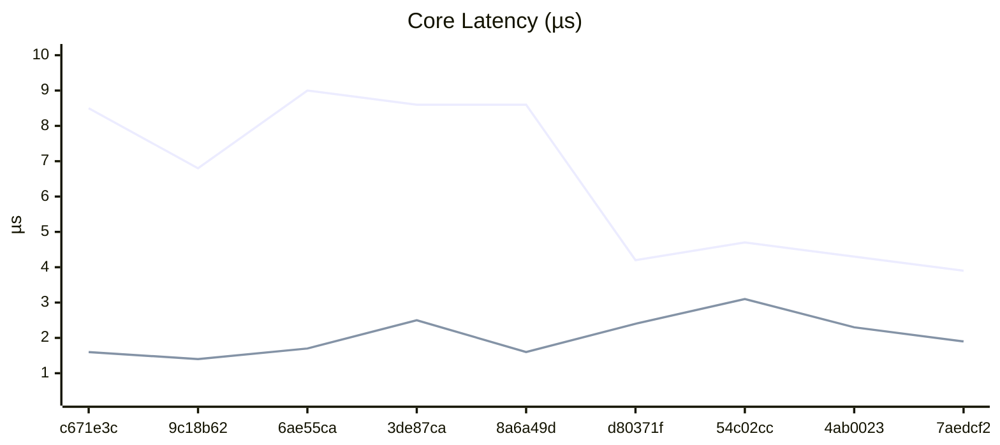
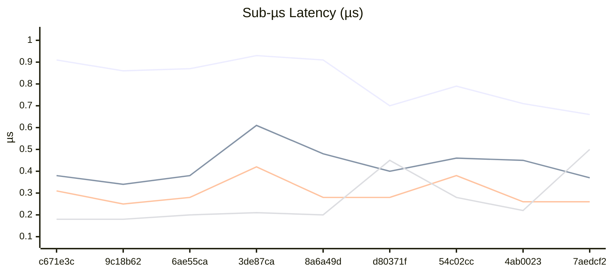
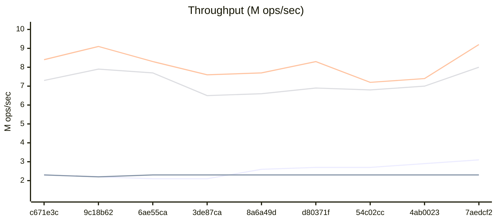

# Benchmark History

> Auto-generated by CI. Last updated: 2026-03-02T07:50:05Z
>
> Tracks the last 50 runs. Oldest entries are pruned automatically.

## Legend

| Symbol | Meaning |
|--------|---------|
| ▲ | Regression (>5% worse) |
| ▼ | Improvement (>5% better) |
| ≈ | Within 5% of previous |

## Latest Run

| Metric | Value |
|--------|-------|
| Node Creation (100K) | 0.12 µs/node ≈ |
| Notification Throughput | 3.13M mutations/sec ▼ |
| Batch Speedup | 1.52x ≈ |
| Deep Chain (1000) | 124.00 µs/propagation ≈ |
| Fan-Out (10K) | 1.26ms ▼ |
| Herald Throughput (10 listeners) | 2.31M events/sec ≈ |
| Pillar Lifecycle (10K) | 3.86 µs/pillar ▼ |
| Diamond Pattern (1K) | 0.66 µs/diamond ▼ |
| Epoch Overhead | 1.06x ▲ |
| Vigil Capture | 9.16M captures/sec ▼ |
| Loom Transition (30K) | 0.37 µs/transition ▼ |
| Sigil Lookup (1M) | 42.81M lookups/sec ▼ |
| Annals Record (100K, cap=1K) | 7.95M records/sec ▼ |
| Tether Call (10K) | 1.32M calls/sec ▼ |
| Conduit Pipeline (10K) | 0.26 µs/set ≈ |
| Prism Projection (10K) | 1.90 µs/projection ▼ |
| Nexus List Add (10K) | 0.50 µs/add ▲ |

## History

| Date | Commit | Dart | Node Creation (100K) | Notification Throughput | Batch Speedup | Deep Chain (1000) | Fan-Out (10K) | Herald Throughput (10 listeners) | Pillar Lifecycle (10K) | Diamond Pattern (1K) | Epoch Overhead | Vigil Capture | Loom Transition (30K) | Sigil Lookup (1M) | Annals Record (100K, cap=1K) | Tether Call (10K) | Conduit Pipeline (10K) | Prism Projection (10K) | Nexus List Add (10K) |
| --- | --- | --- | --- | --- | --- | --- | --- | --- | --- | --- | --- | --- | --- | --- | --- | --- | --- | --- | --- |
| 2026-03-02 07:50 | 7aedcf2 | 3.11.0 | 0.12 µs/node ≈ | 3.13M mutations/sec ▼ | 1.52x ≈ | 124.00 µs/propagation ≈ | 1.26ms ▼ | 2.31M events/sec ≈ | 3.86 µs/pillar ▼ | 0.66 µs/diamond ▼ | 1.06x ▲ | 9.16M captures/sec ▼ | 0.37 µs/transition ▼ | 42.81M lookups/sec ▼ | 7.95M records/sec ▼ | 1.32M calls/sec ▼ | 0.26 µs/set ≈ | 1.90 µs/projection ▼ | 0.50 µs/add ▲ |
| 2026-03-02 07:39 | 4ab0023 | 3.11.0 | 0.12 µs/node ≈ | 2.87M mutations/sec ▼ | 1.57x ≈ | 126.96 µs/propagation ≈ | 1.33ms ≈ | 2.33M events/sec ≈ | 4.32 µs/pillar ▼ | 0.71 µs/diamond ▼ | 1.29x ▼ | 7.43M captures/sec ≈ | 0.45 µs/transition ≈ | 34.26M lookups/sec ≈ | 7.01M records/sec ≈ | 1.09M calls/sec ▼ | 0.26 µs/set ▼ | 2.33 µs/projection ▼ | 0.22 µs/add ▼ |
| 2026-03-02 07:35 | 54c02cc | 3.11.0 | 0.12 µs/node ≈ | 2.73M mutations/sec ≈ | 1.57x ≈ | 132.75 µs/propagation ≈ | 1.36ms ≈ | 2.30M events/sec ≈ | 4.72 µs/pillar ▲ | 0.79 µs/diamond ▲ | 1.12x ≈ | 7.15M captures/sec ▲ | 0.46 µs/transition ▲ | 34.23M lookups/sec ≈ | 6.82M records/sec ≈ | 917.0K calls/sec ▲ | 0.38 µs/set ▲ | 3.08 µs/projection ▲ | 0.28 µs/add ▼ |
| 2026-03-02 07:30 | d80371f | 3.11.0 | 0.12 µs/node ▼ | 2.73M mutations/sec ▼ | 1.57x ≈ | 133.42 µs/propagation ≈ | 1.32ms ≈ | 2.33M events/sec ≈ | 4.23 µs/pillar ▼ | 0.70 µs/diamond ▼ | 1.12x ▼ | 8.26M captures/sec ▼ | 0.40 µs/transition ▼ | 33.24M lookups/sec ≈ | 6.94M records/sec ≈ | 1.10M calls/sec ▲ | 0.28 µs/set ≈ | 2.37 µs/projection ▲ | 0.45 µs/add ▲ |
| 2026-03-02 07:16 | 8a6a49d | 3.11.0 | 0.13 µs/node ▼ | 2.60M mutations/sec ▼ | 1.57x ≈ | 129.41 µs/propagation ≈ | 1.32ms ≈ | 2.32M events/sec ≈ | 8.63 µs/pillar ≈ | 0.91 µs/diamond ≈ | 0.84x ≈ | 7.67M captures/sec ≈ | 0.48 µs/transition ▼ | 33.58M lookups/sec ≈ | 6.63M records/sec ≈ | 2.06M calls/sec ▼ | 0.28 µs/set ▼ | 1.62 µs/projection ▼ | 0.20 µs/add ≈ |
| 2026-03-02 07:00 | 3de87ca | 3.11.0 | 0.15 µs/node ≈ | 2.11M mutations/sec ≈ | 1.56x ▲ | 130.67 µs/propagation ≈ | 1.34ms ≈ | 2.28M events/sec ≈ | 8.58 µs/pillar ≈ | 0.93 µs/diamond ▲ | 0.86x ▲ | 7.64M captures/sec ▲ | 0.61 µs/transition ▲ | 32.69M lookups/sec ▲ | 6.51M records/sec ▲ | 1.54M calls/sec ▲ | 0.42 µs/set ▲ | 2.45 µs/projection ▲ | 0.21 µs/add ≈ |
| 2026-03-02 06:54 | 6ae55ca | 3.11.0 | 0.15 µs/node ≈ | 2.12M mutations/sec ≈ | 1.85x ▼ | 130.37 µs/propagation ≈ | 1.34ms ≈ | 2.31M events/sec ≈ | 8.97 µs/pillar ▲ | 0.87 µs/diamond ≈ | 0.95x ≈ | 8.30M captures/sec ▲ | 0.38 µs/transition ▲ | 35.02M lookups/sec ▲ | 7.65M records/sec ≈ | 2.18M calls/sec ≈ | 0.28 µs/set ▲ | 1.69 µs/projection ▲ | 0.20 µs/add ▲ |
| 2026-03-02 06:21 | 9c18b62 | 3.11.0 | 0.16 µs/node ▼ | 2.21M mutations/sec ▲ | 1.63x ≈ | 127.36 µs/propagation ≈ | 1.34ms ≈ | 2.22M events/sec ≈ | 6.83 µs/pillar ▼ | 0.86 µs/diamond ≈ | 0.96x ▼ | 9.13M captures/sec ▼ | 0.34 µs/transition ▼ | 38.46M lookups/sec ▼ | 7.92M records/sec ▼ | 2.24M calls/sec ≈ | 0.25 µs/set ▼ | 1.43 µs/projection ▼ | 0.18 µs/add |
| 2026-03-02 05:59 | c671e3c | 3.11.0 | 0.22 µs/node | 2.34M mutations/sec | 1.61x | 128.69 µs/propagation | 1.32ms | 2.32M events/sec | 8.46 µs/pillar | 0.91 µs/diamond | 0.84x | 8.43M captures/sec | 0.38 µs/transition | 35.33M lookups/sec | 7.27M records/sec | 2.15M calls/sec | 0.31 µs/set | 1.59 µs/projection | - |

## Performance Trends

> Auto-generated line charts tracking metric trends across CI runs.

### Core Latency

Legend

1. **Pillar Lifecycle (10K)**
2. **Prism Projection (10K)**

### Sub-µs Latency

Legend

1. **Diamond Pattern (1K)**
2. **Loom Transition (30K)**
3. **Conduit Pipeline (10K)**
4. **Nexus List Add (10K)**

### Throughput

Legend

1. **Notification Throughput**
2. **Herald Throughput (10 listeners)**
3. **Vigil Capture**
4. **Annals Record (100K, cap=1K)**

