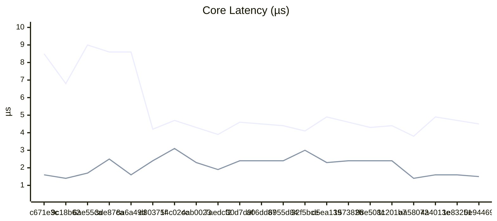
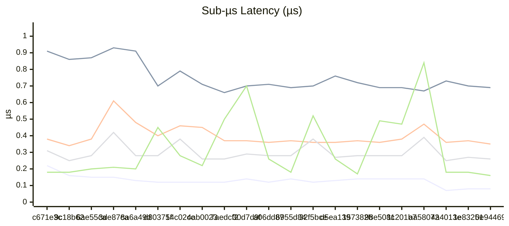
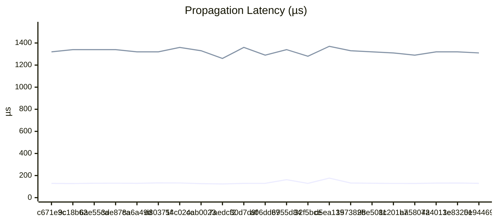
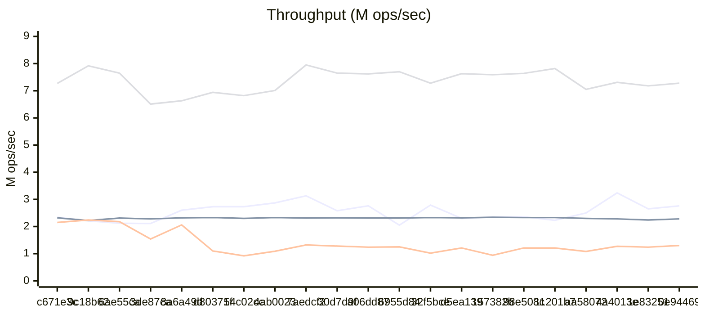
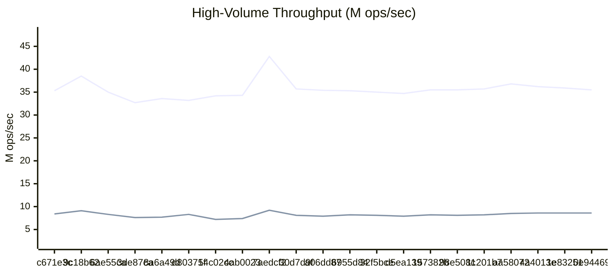
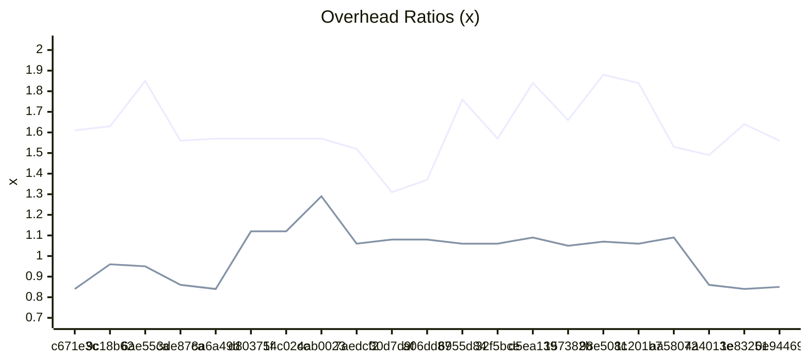

# Benchmark History

> Auto-generated by CI. Last updated: 2026-03-02T18:58:09Z
>
> Tracks the last 50 runs. Oldest entries are pruned automatically.

## Legend

| Symbol | Meaning |
|--------|---------|
| ▲ | Regression (>5% worse) |
| ▼ | Improvement (>5% better) |
| ≈ | Within 5% of previous |

## Latest Run

| Metric | Value |
|--------|-------|
| Node Creation (100K) | 0.08 µs/node ≈ |
| Notification Throughput | 2.76M mutations/sec ≈ |
| Batch Speedup | 1.56x ≈ |
| Deep Chain (1000) | 129.40 µs/propagation ≈ |
| Fan-Out (10K) | 1.31ms ≈ |
| Herald Throughput (10 listeners) | 2.28M events/sec ≈ |
| Pillar Lifecycle (10K) | 4.52 µs/pillar ≈ |
| Diamond Pattern (1K) | 0.69 µs/diamond ≈ |
| Epoch Overhead | 0.85x ≈ |
| Vigil Capture | 8.64M captures/sec ≈ |
| Loom Transition (30K) | 0.35 µs/transition ▼ |
| Sigil Lookup (1M) | 35.55M lookups/sec ≈ |
| Annals Record (100K, cap=1K) | 7.28M records/sec ≈ |
| Tether Call (10K) | 1.30M calls/sec ≈ |
| Conduit Pipeline (10K) | 0.26 µs/set ≈ |
| Prism Projection (10K) | 1.54 µs/projection ≈ |
| Nexus List Add (10K) | 0.16 µs/add ▼ |
| Refresh Full Cycle (50K) | 1.70 µs/refresh ≈ |

## History

| Date | Commit | Dart | Node Creation (100K) | Notification Throughput | Batch Speedup | Deep Chain (1000) | Fan-Out (10K) | Herald Throughput (10 listeners) | Pillar Lifecycle (10K) | Diamond Pattern (1K) | Epoch Overhead | Vigil Capture | Loom Transition (30K) | Sigil Lookup (1M) | Annals Record (100K, cap=1K) | Tether Call (10K) | Conduit Pipeline (10K) | Prism Projection (10K) | Nexus List Add (10K) | Refresh Full Cycle (50K) |
| --- | --- | --- | --- | --- | --- | --- | --- | --- | --- | --- | --- | --- | --- | --- | --- | --- | --- | --- | --- | --- |
| 2026-03-02 18:58 | 0e94469 | 3.11.0 | 0.08 µs/node ≈ | 2.76M mutations/sec ≈ | 1.56x ≈ | 129.40 µs/propagation ≈ | 1.31ms ≈ | 2.28M events/sec ≈ | 4.52 µs/pillar ≈ | 0.69 µs/diamond ≈ | 0.85x ≈ | 8.64M captures/sec ≈ | 0.35 µs/transition ▼ | 35.55M lookups/sec ≈ | 7.28M records/sec ≈ | 1.30M calls/sec ≈ | 0.26 µs/set ≈ | 1.54 µs/projection ≈ | 0.16 µs/add ▼ | 1.70 µs/refresh ≈ |
| 2026-03-02 18:37 | 1e83251 | 3.11.0 | 0.08 µs/node ▲ | 2.65M mutations/sec ▲ | 1.64x ▼ | 132.65 µs/propagation ≈ | 1.32ms ≈ | 2.24M events/sec ≈ | 4.67 µs/pillar ≈ | 0.70 µs/diamond ≈ | 0.84x ≈ | 8.58M captures/sec ≈ | 0.37 µs/transition ≈ | 35.89M lookups/sec ≈ | 7.18M records/sec ≈ | 1.24M calls/sec ≈ | 0.27 µs/set ▲ | 1.58 µs/projection ≈ | 0.18 µs/add ≈ | 1.69 µs/refresh ≈ |
| 2026-03-02 18:15 | 4a4013e | 3.11.0 | 0.07 µs/node ▼ | 3.24M mutations/sec ▼ | 1.49x ≈ | 131.66 µs/propagation ≈ | 1.32ms ≈ | 2.28M events/sec ≈ | 4.87 µs/pillar ▲ | 0.73 µs/diamond ▲ | 0.86x ▲ | 8.57M captures/sec ≈ | 0.36 µs/transition ▼ | 36.21M lookups/sec ≈ | 7.31M records/sec ≈ | 1.27M calls/sec ▼ | 0.25 µs/set ▼ | 1.56 µs/projection ▲ | 0.18 µs/add ▼ | 1.70 µs/refresh |
| 2026-03-02 17:44 | aa58072 | 3.11.0 | 0.14 µs/node ≈ | 2.50M mutations/sec ▼ | 1.53x ▲ | 128.14 µs/propagation ≈ | 1.29ms ≈ | 2.30M events/sec ≈ | 3.82 µs/pillar ▼ | 0.67 µs/diamond ≈ | 1.09x ≈ | 8.52M captures/sec ≈ | 0.47 µs/transition ▲ | 36.77M lookups/sec ≈ | 7.05M records/sec ▲ | 1.08M calls/sec ▲ | 0.39 µs/set ▲ | 1.45 µs/projection ▼ | 0.84 µs/add ▲ | - |
| 2026-03-02 17:25 | 11201b7 | 3.11.0 | 0.14 µs/node ≈ | 2.23M mutations/sec ▲ | 1.84x ≈ | 128.60 µs/propagation ≈ | 1.31ms ≈ | 2.33M events/sec ≈ | 4.40 µs/pillar ≈ | 0.69 µs/diamond ≈ | 1.06x ≈ | 8.20M captures/sec ≈ | 0.38 µs/transition ≈ | 35.69M lookups/sec ≈ | 7.82M records/sec ≈ | 1.21M calls/sec ≈ | 0.28 µs/set ≈ | 2.37 µs/projection ≈ | 0.47 µs/add ≈ | - |
| 2026-03-02 17:09 | 98e508c | 3.11.0 | 0.14 µs/node ≈ | 2.36M mutations/sec ≈ | 1.88x ▼ | 130.40 µs/propagation ≈ | 1.32ms ≈ | 2.33M events/sec ≈ | 4.33 µs/pillar ▼ | 0.69 µs/diamond ≈ | 1.07x ≈ | 8.09M captures/sec ≈ | 0.36 µs/transition ≈ | 35.55M lookups/sec ≈ | 7.64M records/sec ≈ | 1.21M calls/sec ▼ | 0.28 µs/set ≈ | 2.35 µs/projection ≈ | 0.49 µs/add ▲ | - |
| 2026-03-02 10:53 | 157382b | 3.11.0 | 0.14 µs/node ▲ | 2.35M mutations/sec ≈ | 1.66x ▲ | 132.57 µs/propagation ▼ | 1.33ms ≈ | 2.34M events/sec ≈ | 4.61 µs/pillar ▼ | 0.72 µs/diamond ▼ | 1.05x ≈ | 8.22M captures/sec ≈ | 0.37 µs/transition ≈ | 35.47M lookups/sec ≈ | 7.59M records/sec ≈ | 943.3K calls/sec ▲ | 0.28 µs/set ≈ | 2.40 µs/projection ≈ | 0.17 µs/add ▼ | - |
| 2026-03-02 08:18 | d5ea139 | 3.11.0 | 0.13 µs/node ▲ | 2.30M mutations/sec ▲ | 1.84x ▼ | 176.66 µs/propagation ▲ | 1.37ms ▲ | 2.32M events/sec ≈ | 4.92 µs/pillar ▲ | 0.76 µs/diamond ▲ | 1.09x ≈ | 7.87M captures/sec ≈ | 0.36 µs/transition ≈ | 34.74M lookups/sec ≈ | 7.63M records/sec ≈ | 1.21M calls/sec ▼ | 0.27 µs/set ▼ | 2.32 µs/projection ▼ | 0.26 µs/add ▼ | - |
| 2026-03-02 08:09 | 32f5bce | 3.11.0 | 0.12 µs/node ▼ | 2.79M mutations/sec ▼ | 1.57x ▲ | 129.17 µs/propagation ▼ | 1.28ms ≈ | 2.33M events/sec ≈ | 4.13 µs/pillar ▼ | 0.70 µs/diamond ≈ | 1.06x ≈ | 8.11M captures/sec ≈ | 0.36 µs/transition ≈ | 35.05M lookups/sec ≈ | 7.28M records/sec ▲ | 1.02M calls/sec ▲ | 0.38 µs/set ▲ | 2.96 µs/projection ▲ | 0.52 µs/add ▲ | - |
| 2026-03-02 08:03 | 6955d84 | 3.11.0 | 0.14 µs/node ▲ | 2.05M mutations/sec ▲ | 1.76x ▼ | 162.43 µs/propagation ▲ | 1.34ms ≈ | 2.31M events/sec ≈ | 4.39 µs/pillar ≈ | 0.69 µs/diamond ≈ | 1.06x ≈ | 8.17M captures/sec ≈ | 0.37 µs/transition ≈ | 35.27M lookups/sec ≈ | 7.70M records/sec ≈ | 1.25M calls/sec ≈ | 0.28 µs/set ≈ | 2.41 µs/projection ≈ | 0.18 µs/add ▼ | - |
| 2026-03-02 08:01 | a06dd87 | 3.11.0 | 0.12 µs/node ▼ | 2.76M mutations/sec ▼ | 1.37x ≈ | 129.57 µs/propagation ≈ | 1.29ms ▼ | 2.31M events/sec ≈ | 4.48 µs/pillar ≈ | 0.71 µs/diamond ≈ | 1.08x ≈ | 7.90M captures/sec ≈ | 0.36 µs/transition ≈ | 35.42M lookups/sec ≈ | 7.62M records/sec ≈ | 1.24M calls/sec ≈ | 0.28 µs/set ≈ | 2.39 µs/projection ≈ | 0.26 µs/add ▼ | - |
| 2026-03-02 07:54 | 30d7d9f | 3.11.0 | 0.14 µs/node ▲ | 2.58M mutations/sec ▲ | 1.31x ▲ | 128.87 µs/propagation ≈ | 1.36ms ▲ | 2.32M events/sec ≈ | 4.62 µs/pillar ▲ | 0.70 µs/diamond ▲ | 1.08x ≈ | 8.07M captures/sec ▲ | 0.37 µs/transition ≈ | 35.67M lookups/sec ▲ | 7.65M records/sec ≈ | 1.28M calls/sec ≈ | 0.29 µs/set ▲ | 2.42 µs/projection ▲ | 0.70 µs/add ▲ | - |
| 2026-03-02 07:50 | 7aedcf2 | 3.11.0 | 0.12 µs/node ≈ | 3.13M mutations/sec ▼ | 1.52x ≈ | 124.00 µs/propagation ≈ | 1.26ms ▼ | 2.31M events/sec ≈ | 3.86 µs/pillar ▼ | 0.66 µs/diamond ▼ | 1.06x ▲ | 9.16M captures/sec ▼ | 0.37 µs/transition ▼ | 42.81M lookups/sec ▼ | 7.95M records/sec ▼ | 1.32M calls/sec ▼ | 0.26 µs/set ≈ | 1.90 µs/projection ▼ | 0.50 µs/add ▲ | - |
| 2026-03-02 07:39 | 4ab0023 | 3.11.0 | 0.12 µs/node ≈ | 2.87M mutations/sec ▼ | 1.57x ≈ | 126.96 µs/propagation ≈ | 1.33ms ≈ | 2.33M events/sec ≈ | 4.32 µs/pillar ▼ | 0.71 µs/diamond ▼ | 1.29x ▼ | 7.43M captures/sec ≈ | 0.45 µs/transition ≈ | 34.26M lookups/sec ≈ | 7.01M records/sec ≈ | 1.09M calls/sec ▼ | 0.26 µs/set ▼ | 2.33 µs/projection ▼ | 0.22 µs/add ▼ | - |
| 2026-03-02 07:35 | 54c02cc | 3.11.0 | 0.12 µs/node ≈ | 2.73M mutations/sec ≈ | 1.57x ≈ | 132.75 µs/propagation ≈ | 1.36ms ≈ | 2.30M events/sec ≈ | 4.72 µs/pillar ▲ | 0.79 µs/diamond ▲ | 1.12x ≈ | 7.15M captures/sec ▲ | 0.46 µs/transition ▲ | 34.23M lookups/sec ≈ | 6.82M records/sec ≈ | 917.0K calls/sec ▲ | 0.38 µs/set ▲ | 3.08 µs/projection ▲ | 0.28 µs/add ▼ | - |
| 2026-03-02 07:30 | d80371f | 3.11.0 | 0.12 µs/node ▼ | 2.73M mutations/sec ▼ | 1.57x ≈ | 133.42 µs/propagation ≈ | 1.32ms ≈ | 2.33M events/sec ≈ | 4.23 µs/pillar ▼ | 0.70 µs/diamond ▼ | 1.12x ▼ | 8.26M captures/sec ▼ | 0.40 µs/transition ▼ | 33.24M lookups/sec ≈ | 6.94M records/sec ≈ | 1.10M calls/sec ▲ | 0.28 µs/set ≈ | 2.37 µs/projection ▲ | 0.45 µs/add ▲ | - |
| 2026-03-02 07:16 | 8a6a49d | 3.11.0 | 0.13 µs/node ▼ | 2.60M mutations/sec ▼ | 1.57x ≈ | 129.41 µs/propagation ≈ | 1.32ms ≈ | 2.32M events/sec ≈ | 8.63 µs/pillar ≈ | 0.91 µs/diamond ≈ | 0.84x ≈ | 7.67M captures/sec ≈ | 0.48 µs/transition ▼ | 33.58M lookups/sec ≈ | 6.63M records/sec ≈ | 2.06M calls/sec ▼ | 0.28 µs/set ▼ | 1.62 µs/projection ▼ | 0.20 µs/add ≈ | - |
| 2026-03-02 07:00 | 3de87ca | 3.11.0 | 0.15 µs/node ≈ | 2.11M mutations/sec ≈ | 1.56x ▲ | 130.67 µs/propagation ≈ | 1.34ms ≈ | 2.28M events/sec ≈ | 8.58 µs/pillar ≈ | 0.93 µs/diamond ▲ | 0.86x ▲ | 7.64M captures/sec ▲ | 0.61 µs/transition ▲ | 32.69M lookups/sec ▲ | 6.51M records/sec ▲ | 1.54M calls/sec ▲ | 0.42 µs/set ▲ | 2.45 µs/projection ▲ | 0.21 µs/add ≈ | - |
| 2026-03-02 06:54 | 6ae55ca | 3.11.0 | 0.15 µs/node ≈ | 2.12M mutations/sec ≈ | 1.85x ▼ | 130.37 µs/propagation ≈ | 1.34ms ≈ | 2.31M events/sec ≈ | 8.97 µs/pillar ▲ | 0.87 µs/diamond ≈ | 0.95x ≈ | 8.30M captures/sec ▲ | 0.38 µs/transition ▲ | 35.02M lookups/sec ▲ | 7.65M records/sec ≈ | 2.18M calls/sec ≈ | 0.28 µs/set ▲ | 1.69 µs/projection ▲ | 0.20 µs/add ▲ | - |
| 2026-03-02 06:21 | 9c18b62 | 3.11.0 | 0.16 µs/node ▼ | 2.21M mutations/sec ▲ | 1.63x ≈ | 127.36 µs/propagation ≈ | 1.34ms ≈ | 2.22M events/sec ≈ | 6.83 µs/pillar ▼ | 0.86 µs/diamond ≈ | 0.96x ▼ | 9.13M captures/sec ▼ | 0.34 µs/transition ▼ | 38.46M lookups/sec ▼ | 7.92M records/sec ▼ | 2.24M calls/sec ≈ | 0.25 µs/set ▼ | 1.43 µs/projection ▼ | 0.18 µs/add | - |
| 2026-03-02 05:59 | c671e3c | 3.11.0 | 0.22 µs/node | 2.34M mutations/sec | 1.61x | 128.69 µs/propagation | 1.32ms | 2.32M events/sec | 8.46 µs/pillar | 0.91 µs/diamond | 0.84x | 8.43M captures/sec | 0.38 µs/transition | 35.33M lookups/sec | 7.27M records/sec | 2.15M calls/sec | 0.31 µs/set | 1.59 µs/projection | - | - |

## Performance Trends

> Auto-generated line charts tracking metric trends across CI runs.

### Core Latency

Legend

| Color | Metric |
|-------|--------|
| 🔵 Steel Blue | **Pillar Lifecycle (10K)** |
| 🟠 Orange | **Prism Projection (10K)** |

### Sub-µs Latency

Legend

| Color | Metric |
|-------|--------|
| 🔵 Steel Blue | **Node Creation (100K)** |
| 🟠 Orange | **Diamond Pattern (1K)** |
| 🔴 Coral Red | **Loom Transition (30K)** |
| 🟢 Teal | **Conduit Pipeline (10K)** |
| 🟩 Green | **Nexus List Add (10K)** |

### Propagation Latency

Legend

| Color | Metric |
|-------|--------|
| 🔵 Steel Blue | **Deep Chain (1000)** |
| 🟠 Orange | **Fan-Out (10K)** |

### Throughput

Legend

| Color | Metric |
|-------|--------|
| 🔵 Steel Blue | **Notification Throughput** |
| 🟠 Orange | **Herald Throughput (10 listeners)** |
| 🔴 Coral Red | **Tether Call (10K)** |
| 🟢 Teal | **Annals Record (100K, cap=1K)** |

### High-Volume Throughput

Legend

| Color | Metric |
|-------|--------|
| 🔵 Steel Blue | **Sigil Lookup (1M)** |
| 🟠 Orange | **Vigil Capture** |

### Overhead Ratios

Legend

| Color | Metric |
|-------|--------|
| 🔵 Steel Blue | **Batch Speedup** |
| 🟠 Orange | **Epoch Overhead** |

