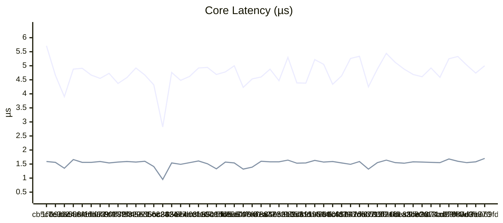
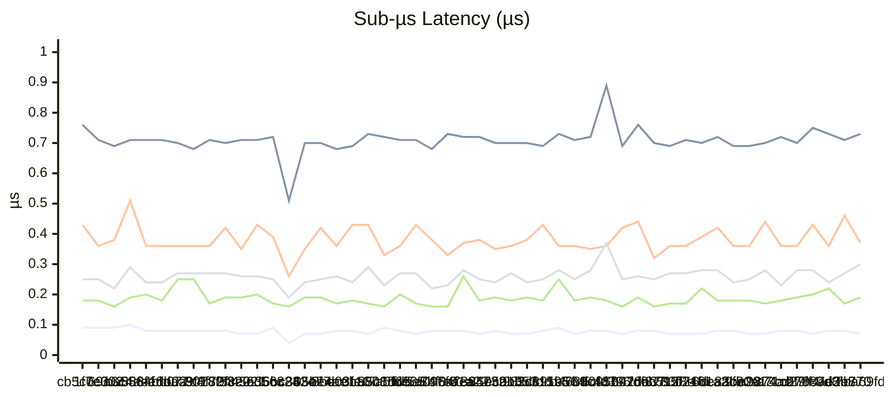
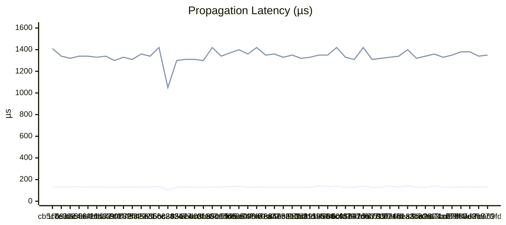
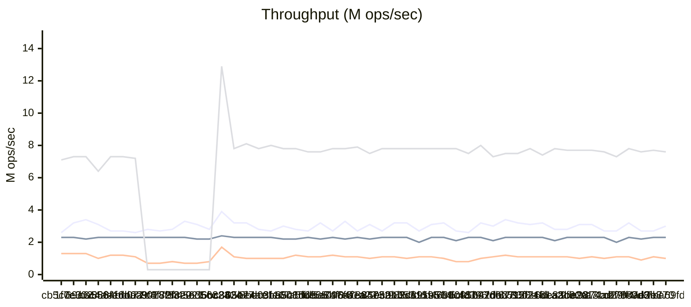
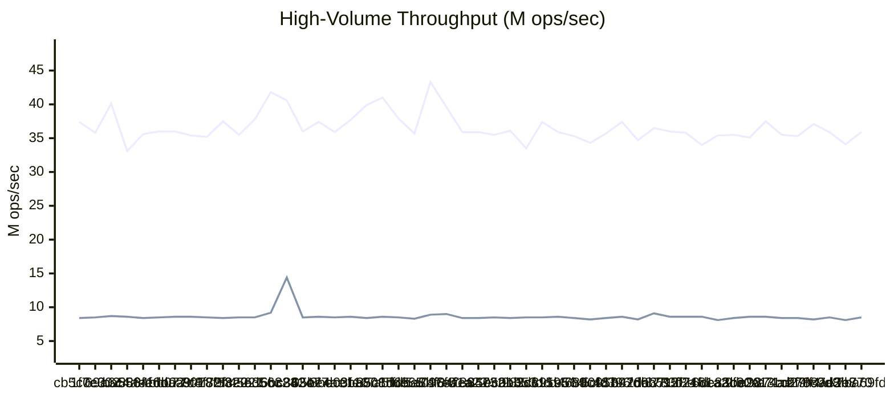
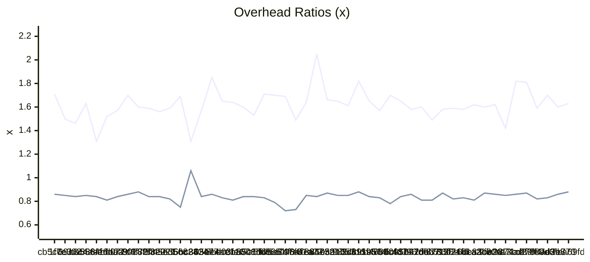

# Benchmark History

> Auto-generated by CI. Last updated: 2026-03-12T13:28:35Z
>
> Tracks the last 50 runs. Oldest entries are pruned automatically.

## Legend

| Symbol | Meaning |
|--------|---------|
| ▲ | Regression (>5% worse) |
| ▼ | Improvement (>5% better) |
| ≈ | Within 5% of previous |

## Latest Run

| Metric | Value |
|--------|-------|
| Node Creation (100K) | 0.07 µs/node ▼ |
| Notification Throughput | 3.01M mutations/sec ▼ |
| Batch Speedup | 1.63x ≈ |
| Deep Chain (1000) | 131.09 µs/propagation ≈ |
| Fan-Out (10K) | 1.35ms ≈ |
| Herald Throughput (10 listeners) | 2.27M events/sec ≈ |
| Pillar Lifecycle (10K) | 5.00 µs/pillar ▲ |
| Diamond Pattern (1K) | 0.73 µs/diamond ≈ |
| Epoch Overhead | 0.88x ≈ |
| Vigil Capture | 8.52M captures/sec ▼ |
| Loom Transition (30K) | 0.37 µs/transition ▼ |
| Sigil Lookup (1M) | 35.87M lookups/sec ▼ |
| Annals Record (100K, cap=1K) | 7.61M records/sec ≈ |
| Tether Call (10K) | 957.9K calls/sec ▲ |
| Conduit Pipeline (10K) | 0.30 µs/set ▲ |
| Prism Projection (10K) | 1.70 µs/projection ▲ |
| Nexus List Add (10K) | 0.19 µs/add ▲ |
| Refresh Full Cycle (50K) | 1.72 µs/refresh ≈ |
| Banner Lookup (100 flags, 100K) | 0.18 µs/op ▲ |
| Sieve Filter (10K items, 1K) | 265.69 µs/op ≈ |
| Lattice Diamond (4 nodes, 1K) | 48.38 µs/op ≈ |
| Embargo MutexGuard (1K) | 3.28 µs/op ▼ |
| Census Record (10K) | 4.17 µs/op ≈ |
| Warden CheckService (1K) | 4.78 µs/op ▲ |
| Arbiter Submit+Resolve LWW (10K) | 15.92 µs/op ▲ |
| Lode Acquire+Release (10K) | 1.00 µs/op ▲ |
| Tithe Consume (100K) | 0.07 µs/op ▲ |
| Sluice Feed+Flush 1-stage (100K) | 0.83 µs/op ≈ |
| Clarion Trigger (100K) | 0.08 µs/op ≈ |
| Tapestry Append+Weave (100K) | 0.43 µs/op ≈ |

## History

| Date | Commit | Dart | Node Creation (100K) | Notification Throughput | Batch Speedup | Deep Chain (1000) | Fan-Out (10K) | Herald Throughput (10 listeners) | Pillar Lifecycle (10K) | Diamond Pattern (1K) | Epoch Overhead | Vigil Capture | Loom Transition (30K) | Sigil Lookup (1M) | Annals Record (100K, cap=1K) | Tether Call (10K) | Conduit Pipeline (10K) | Prism Projection (10K) | Nexus List Add (10K) | Refresh Full Cycle (50K) | Banner Lookup (100 flags, 100K) | Sieve Filter (10K items, 1K) | Lattice Diamond (4 nodes, 1K) | Embargo MutexGuard (1K) | Census Record (10K) | Warden CheckService (1K) | Arbiter Submit+Resolve LWW (10K) | Lode Acquire+Release (10K) | Tithe Consume (100K) | Sluice Feed+Flush 1-stage (100K) | Clarion Trigger (100K) | Tapestry Append+Weave (100K) |
| --- | --- | --- | --- | --- | --- | --- | --- | --- | --- | --- | --- | --- | --- | --- | --- | --- | --- | --- | --- | --- | --- | --- | --- | --- | --- | --- | --- | --- | --- | --- | --- | --- |
| 2026-03-12 13:28 | 7ba69fd | 3.11.0 | 0.07 µs/node ▼ | 3.01M mutations/sec ▼ | 1.63x ≈ | 131.09 µs/propagation ≈ | 1.35ms ≈ | 2.27M events/sec ≈ | 5.00 µs/pillar ▲ | 0.73 µs/diamond ≈ | 0.88x ≈ | 8.52M captures/sec ▼ | 0.37 µs/transition ▼ | 35.87M lookups/sec ▼ | 7.61M records/sec ≈ | 957.9K calls/sec ▲ | 0.30 µs/set ▲ | 1.70 µs/projection ▲ | 0.19 µs/add ▲ | 1.72 µs/refresh ≈ | 0.18 µs/op ▲ | 265.69 µs/op ≈ | 48.38 µs/op ≈ | 3.28 µs/op ▼ | 4.17 µs/op ≈ | 4.78 µs/op ▲ | 15.92 µs/op ▲ | 1.00 µs/op ▲ | 0.07 µs/op ▲ | 0.83 µs/op ≈ | 0.08 µs/op ≈ | 0.43 µs/op ≈ |
| 2026-03-09 15:29 | ae2e770 | 3.11.0 | 0.08 µs/node ≈ | 2.71M mutations/sec ≈ | 1.60x ▲ | 131.16 µs/propagation ≈ | 1.34ms ≈ | 2.28M events/sec ≈ | 4.74 µs/pillar ▼ | 0.71 µs/diamond ≈ | 0.86x ≈ | 8.11M captures/sec ≈ | 0.46 µs/transition ▲ | 34.06M lookups/sec ▲ | 7.72M records/sec ≈ | 1.06M calls/sec ▼ | 0.27 µs/set ▲ | 1.58 µs/projection ≈ | 0.17 µs/add ▼ | 1.71 µs/refresh ≈ | 0.17 µs/op ≈ | 266.34 µs/op ≈ | 46.20 µs/op ≈ | 3.59 µs/op ▲ | 4.14 µs/op ≈ | 3.69 µs/op ▼ | 14.80 µs/op ▼ | 0.86 µs/op ▼ | 0.06 µs/op ≈ | 0.82 µs/op ▲ | 0.08 µs/op ▲ | 0.43 µs/op ▲ |
| 2026-03-09 15:03 | 087d3b8 | 3.11.0 | 0.08 µs/node ▲ | 2.68M mutations/sec ▲ | 1.70x ▼ | 131.26 µs/propagation ≈ | 1.38ms ≈ | 2.22M events/sec ≈ | 5.02 µs/pillar ▼ | 0.73 µs/diamond ≈ | 0.83x ≈ | 8.49M captures/sec ≈ | 0.36 µs/transition ▼ | 35.93M lookups/sec ≈ | 7.60M records/sec ≈ | 945.8K calls/sec ▲ | 0.24 µs/set ▼ | 1.55 µs/projection ≈ | 0.22 µs/add ▲ | 1.70 µs/refresh ≈ | 0.17 µs/op ≈ | 269.03 µs/op ≈ | 46.61 µs/op ≈ | 3.40 µs/op ▼ | 4.08 µs/op ▼ | 4.82 µs/op ▲ | 15.64 µs/op ≈ | 0.91 µs/op ▲ | 0.06 µs/op ≈ | 0.76 µs/op ≈ | 0.07 µs/op ▼ | 0.38 µs/op ▼ |
| 2026-03-09 14:30 | 278c9d8 | 3.11.0 | 0.07 µs/node ▼ | 3.17M mutations/sec ▼ | 1.59x ▲ | 133.15 µs/propagation ≈ | 1.38ms ≈ | 2.27M events/sec ▼ | 5.33 µs/pillar ≈ | 0.75 µs/diamond ▲ | 0.82x ▲ | 8.21M captures/sec ≈ | 0.43 µs/transition ▲ | 37.14M lookups/sec ▼ | 7.75M records/sec ▼ | 1.05M calls/sec ≈ | 0.28 µs/set ≈ | 1.60 µs/projection ≈ | 0.20 µs/add ≈ | 1.75 µs/refresh ≈ | 0.18 µs/op ≈ | 268.96 µs/op ≈ | 48.38 µs/op ▲ | 3.65 µs/op ▲ | 4.58 µs/op ▲ | 2.92 µs/op ▼ | 16.24 µs/op ▲ | 0.82 µs/op ≈ | 0.06 µs/op ≈ | 0.77 µs/op ≈ | 0.08 µs/op ≈ | 0.40 µs/op ▲ |
| 2026-03-09 13:57 | cd27ff4 | 3.11.0 | 0.08 µs/node ≈ | 2.72M mutations/sec ≈ | 1.81x ≈ | 128.15 µs/propagation ≈ | 1.35ms ≈ | 2.04M events/sec ▲ | 5.25 µs/pillar ▲ | 0.70 µs/diamond ≈ | 0.87x ≈ | 8.39M captures/sec ≈ | 0.36 µs/transition ≈ | 35.29M lookups/sec ≈ | 7.31M records/sec ≈ | 1.07M calls/sec ≈ | 0.28 µs/set ▲ | 1.68 µs/projection ▲ | 0.19 µs/add ≈ | 1.71 µs/refresh ≈ | 0.18 µs/op ▲ | 266.81 µs/op ≈ | 45.27 µs/op ≈ | 3.46 µs/op ≈ | 4.15 µs/op ≈ | 3.31 µs/op ▲ | 14.83 µs/op ≈ | 0.82 µs/op ▲ | 0.06 µs/op ≈ | 0.75 µs/op ▼ | 0.08 µs/op ≈ | 0.38 µs/op ▼ |
| 2026-03-09 13:40 | a71cbf9 | 3.11.0 | 0.08 µs/node ▲ | 2.74M mutations/sec ▲ | 1.82x ▼ | 129.86 µs/propagation ▼ | 1.33ms ≈ | 2.26M events/sec ≈ | 4.59 µs/pillar ▼ | 0.72 µs/diamond ≈ | 0.86x ≈ | 8.36M captures/sec ≈ | 0.36 µs/transition ▼ | 35.47M lookups/sec ▲ | 7.63M records/sec ≈ | 1.03M calls/sec ≈ | 0.23 µs/set ▼ | 1.55 µs/projection ≈ | 0.18 µs/add ▲ | 1.66 µs/refresh ≈ | 0.17 µs/op ≈ | 264.59 µs/op ≈ | 44.51 µs/op ≈ | 3.39 µs/op ≈ | 4.37 µs/op ≈ | 2.80 µs/op ≈ | 15.49 µs/op ≈ | 0.72 µs/op ▼ | 0.06 µs/op ≈ | 0.82 µs/op ▲ | 0.08 µs/op ≈ | 0.41 µs/op ▲ |
| 2026-03-09 13:30 | a9874ae | 3.11.0 | 0.07 µs/node ≈ | 3.06M mutations/sec ≈ | 1.42x ▲ | 139.75 µs/propagation ▲ | 1.36ms ≈ | 2.28M events/sec ≈ | 4.92 µs/pillar ▲ | 0.70 µs/diamond ≈ | 0.85x ≈ | 8.56M captures/sec ≈ | 0.44 µs/transition ▲ | 37.54M lookups/sec ▼ | 7.70M records/sec ≈ | 1.07M calls/sec ≈ | 0.28 µs/set ▲ | 1.56 µs/projection ≈ | 0.17 µs/add ≈ | 1.72 µs/refresh ≈ | 0.18 µs/op ≈ | 264.08 µs/op ≈ | 44.98 µs/op ≈ | 3.28 µs/op ▼ | 4.45 µs/op ▲ | 2.90 µs/op ▼ | 15.35 µs/op ≈ | 0.83 µs/op ≈ | 0.06 µs/op ≈ | 0.75 µs/op ≈ | 0.08 µs/op ▼ | 0.39 µs/op ▲ |
| 2026-03-09 13:23 | 9f30a13 | 3.11.0 | 0.07 µs/node ▼ | 3.13M mutations/sec ▼ | 1.62x ≈ | 128.83 µs/propagation ≈ | 1.34ms ≈ | 2.29M events/sec ≈ | 4.61 µs/pillar ≈ | 0.69 µs/diamond ≈ | 0.86x ≈ | 8.55M captures/sec ≈ | 0.36 µs/transition ≈ | 35.07M lookups/sec ≈ | 7.70M records/sec ≈ | 1.03M calls/sec ≈ | 0.25 µs/set ▲ | 1.57 µs/projection ≈ | 0.18 µs/add ≈ | 1.69 µs/refresh ≈ | 0.18 µs/op ≈ | 264.11 µs/op ≈ | 44.43 µs/op ▼ | 3.46 µs/op ▲ | 4.09 µs/op ≈ | 3.91 µs/op ▲ | 15.27 µs/op ≈ | 0.83 µs/op ▼ | 0.06 µs/op ▼ | 0.75 µs/op ≈ | 0.08 µs/op ▲ | 0.37 µs/op ≈ |
| 2026-03-09 13:13 | e83be20 | 3.11.0 | 0.08 µs/node ≈ | 2.75M mutations/sec ≈ | 1.60x ≈ | 128.07 µs/propagation ▼ | 1.32ms ▼ | 2.31M events/sec ▼ | 4.69 µs/pillar ≈ | 0.69 µs/diamond ≈ | 0.87x ▼ | 8.41M captures/sec ≈ | 0.36 µs/transition ▼ | 35.54M lookups/sec ≈ | 7.68M records/sec ≈ | 1.05M calls/sec ≈ | 0.24 µs/set ▼ | 1.58 µs/projection ≈ | 0.18 µs/add ≈ | 1.68 µs/refresh ≈ | 0.18 µs/op ≈ | 264.80 µs/op ▼ | 49.97 µs/op ▲ | 3.24 µs/op ≈ | 4.13 µs/op ▼ | 3.46 µs/op ▼ | 14.86 µs/op ▼ | 0.92 µs/op ▲ | 0.07 µs/op ▲ | 0.78 µs/op ≈ | 0.07 µs/op ≈ | 0.39 µs/op ≈ |
| 2026-03-09 13:06 | 6dcaacb | 3.11.0 | 0.08 µs/node ▲ | 2.78M mutations/sec ▲ | 1.62x ≈ | 141.09 µs/propagation ▲ | 1.40ms ≈ | 2.15M events/sec ▲ | 4.88 µs/pillar ≈ | 0.72 µs/diamond ≈ | 0.81x ≈ | 8.14M captures/sec ≈ | 0.42 µs/transition ▲ | 35.40M lookups/sec ≈ | 7.79M records/sec ≈ | 1.05M calls/sec ≈ | 0.28 µs/set ≈ | 1.53 µs/projection ≈ | 0.18 µs/add ▼ | 1.68 µs/refresh ≈ | 0.17 µs/op ≈ | 278.96 µs/op ≈ | 39.58 µs/op ▼ | 3.38 µs/op ≈ | 4.55 µs/op ≈ | 6.01 µs/op ▲ | 16.11 µs/op ▲ | 0.73 µs/op ▼ | 0.06 µs/op ≈ | 0.79 µs/op ≈ | 0.07 µs/op ≈ | 0.37 µs/op ≈ |
| 2026-03-09 12:58 | 07161a2 | 3.11.0 | 0.07 µs/node ≈ | 3.22M mutations/sec ≈ | 1.58x ≈ | 131.08 µs/propagation ▼ | 1.34ms ≈ | 2.28M events/sec ≈ | 5.12 µs/pillar ▼ | 0.70 µs/diamond ≈ | 0.83x ≈ | 8.57M captures/sec ≈ | 0.39 µs/transition ▲ | 33.99M lookups/sec ▲ | 7.43M records/sec ▲ | 1.05M calls/sec ≈ | 0.28 µs/set ≈ | 1.55 µs/projection ▼ | 0.22 µs/add ▲ | 1.69 µs/refresh ≈ | 0.17 µs/op ≈ | 266.74 µs/op ≈ | 45.97 µs/op ≈ | 3.46 µs/op ≈ | 4.37 µs/op ▲ | 3.90 µs/op ▲ | 14.98 µs/op ≈ | 0.90 µs/op ▲ | 0.06 µs/op ≈ | 0.79 µs/op ≈ | 0.07 µs/op ≈ | 0.38 µs/op ≈ |
| 2026-03-09 12:52 | 95f24fd | 3.11.0 | 0.07 µs/node ≈ | 3.15M mutations/sec ≈ | 1.59x ≈ | 140.46 µs/propagation ▲ | 1.33ms ≈ | 2.26M events/sec ≈ | 5.44 µs/pillar ▲ | 0.71 µs/diamond ≈ | 0.82x ▲ | 8.59M captures/sec ≈ | 0.36 µs/transition ≈ | 35.82M lookups/sec ≈ | 7.83M records/sec ≈ | 1.09M calls/sec ≈ | 0.27 µs/set ≈ | 1.64 µs/projection ▲ | 0.17 µs/add ≈ | 1.70 µs/refresh ≈ | 0.17 µs/op ≈ | 264.80 µs/op ≈ | 45.86 µs/op ≈ | 3.46 µs/op ▼ | 4.10 µs/op ▼ | 3.27 µs/op ▼ | 15.77 µs/op ▲ | 0.85 µs/op ≈ | 0.06 µs/op ▼ | 0.76 µs/op ≈ | 0.07 µs/op ▼ | 0.39 µs/op ▲ |
| 2026-03-09 12:40 | 8783f8e | 3.11.0 | 0.07 µs/node ▼ | 3.18M mutations/sec ▲ | 1.58x ▼ | 128.14 µs/propagation ≈ | 1.32ms ≈ | 2.26M events/sec ≈ | 4.88 µs/pillar ▲ | 0.69 µs/diamond ≈ | 0.87x ▼ | 8.59M captures/sec ▲ | 0.36 µs/transition ▲ | 36.01M lookups/sec ≈ | 7.52M records/sec ≈ | 1.07M calls/sec ▲ | 0.27 µs/set ▲ | 1.55 µs/projection ▲ | 0.17 µs/add ▲ | 1.69 µs/refresh ▲ | 0.17 µs/op ≈ | 265.49 µs/op ≈ | 45.33 µs/op ▲ | 4.95 µs/op ▲ | 4.62 µs/op ▲ | 5.01 µs/op ▲ | 14.91 µs/op ▲ | 0.87 µs/op ▲ | 0.07 µs/op ▲ | 0.76 µs/op ▼ | 0.08 µs/op ▲ | 0.37 µs/op ▼ |
| 2026-03-09 12:09 | fd6b512 | 3.11.0 | 0.08 µs/node ▼ | 3.35M mutations/sec ▼ | 1.49x ▲ | 127.39 µs/propagation ▼ | 1.31ms ▼ | 2.29M events/sec ▼ | 4.25 µs/pillar ▼ | 0.70 µs/diamond ▼ | 0.81x ≈ | 9.13M captures/sec ▼ | 0.32 µs/transition ▼ | 36.48M lookups/sec ▼ | 7.55M records/sec ≈ | 1.22M calls/sec ▼ | 0.25 µs/set ▼ | 1.32 µs/projection ▼ | 0.16 µs/add ▼ | 1.57 µs/refresh ▼ | 0.17 µs/op ▼ | 274.98 µs/op ≈ | 39.99 µs/op ▼ | 3.24 µs/op ≈ | 2.48 µs/op ▼ | 3.36 µs/op ▲ | 8.63 µs/op ▼ | 0.79 µs/op ≈ | 0.05 µs/op ▼ | 0.80 µs/op ≈ | 0.07 µs/op ≈ | 0.42 µs/op ≈ |
| 2026-03-09 11:57 | b42da37 | 3.11.0 | 0.08 µs/node ▲ | 2.97M mutations/sec ▲ | 1.60x ≈ | 139.37 µs/propagation ▲ | 1.42ms ▲ | 2.10M events/sec ▲ | 5.34 µs/pillar ≈ | 0.76 µs/diamond ▲ | 0.81x ▲ | 8.17M captures/sec ≈ | 0.44 µs/transition ≈ | 34.73M lookups/sec ▲ | 7.28M records/sec ▲ | 1.05M calls/sec ▼ | 0.26 µs/set ≈ | 1.59 µs/projection ▲ | 0.19 µs/add ▲ | 1.78 µs/refresh ▲ | 0.18 µs/op ≈ | 284.39 µs/op ▲ | 43.76 µs/op ≈ | 3.33 µs/op ≈ | 4.98 µs/op ▲ | 2.38 µs/op ▼ | 15.93 µs/op ▲ | 0.81 µs/op ≈ | 0.08 µs/op ▲ | 0.79 µs/op ▲ | 0.07 µs/op ▼ | 0.43 µs/op ▲ |
| 2026-03-09 11:50 | 958976b | 3.11.0 | 0.07 µs/node ▼ | 3.23M mutations/sec ▼ | 1.58x ≈ | 128.10 µs/propagation ≈ | 1.31ms ≈ | 2.29M events/sec ≈ | 5.26 µs/pillar ▲ | 0.69 µs/diamond ▼ | 0.86x ≈ | 8.59M captures/sec ≈ | 0.42 µs/transition ▲ | 37.44M lookups/sec ≈ | 7.96M records/sec ▼ | 982.8K calls/sec ▼ | 0.25 µs/set ▼ | 1.49 µs/projection ≈ | 0.16 µs/add ▼ | 1.68 µs/refresh ≈ | 0.18 µs/op ≈ | 265.43 µs/op ≈ | 45.15 µs/op ≈ | 3.17 µs/op ▼ | 4.20 µs/op ≈ | 2.83 µs/op ▼ | 15.15 µs/op ≈ | 0.80 µs/op ▼ | 0.06 µs/op ≈ | 0.74 µs/op ▼ | 0.08 µs/op ≈ | 0.37 µs/op ▼ |
| 2026-03-09 11:12 | 5cfd396 | 3.11.0 | 0.08 µs/node ≈ | 2.65M mutations/sec ≈ | 1.65x ≈ | 128.97 µs/propagation ▼ | 1.33ms ▼ | 2.26M events/sec ▼ | 4.64 µs/pillar ▲ | 0.89 µs/diamond ▲ | 0.84x ▼ | 8.40M captures/sec ≈ | 0.36 µs/transition ≈ | 35.68M lookups/sec ≈ | 7.48M records/sec ≈ | 822.9K calls/sec ≈ | 0.37 µs/set ▲ | 1.54 µs/projection ≈ | 0.18 µs/add ≈ | 1.70 µs/refresh ≈ | 0.17 µs/op ≈ | 264.70 µs/op ▼ | 46.98 µs/op ▲ | 3.62 µs/op ≈ | 4.14 µs/op ▼ | 3.97 µs/op ▲ | 14.92 µs/op ▼ | 0.93 µs/op ▲ | 0.06 µs/op ▼ | 0.81 µs/op ▼ | 0.08 µs/op ▲ | 0.41 µs/op ≈ |
| 2026-03-09 11:05 | 7b9c487 | 3.11.0 | 0.08 µs/node ▲ | 2.70M mutations/sec ▲ | 1.70x ▼ | 139.81 µs/propagation ▲ | 1.42ms ▲ | 2.12M events/sec ▲ | 4.34 µs/pillar ▼ | 0.72 µs/diamond ≈ | 0.78x ▲ | 8.20M captures/sec ≈ | 0.35 µs/transition ≈ | 34.31M lookups/sec ≈ | 7.76M records/sec ≈ | 839.3K calls/sec ▲ | 0.28 µs/set ▲ | 1.59 µs/projection ≈ | 0.19 µs/add ▲ | 1.66 µs/refresh ≈ | 0.17 µs/op ≈ | 280.59 µs/op ▲ | 41.05 µs/op ▼ | 3.45 µs/op ≈ | 4.73 µs/op ▲ | 3.31 µs/op ▼ | 16.99 µs/op ▲ | 0.76 µs/op ▼ | 0.07 µs/op ▲ | 1.00 µs/op ▲ | 0.07 µs/op ▲ | 0.43 µs/op ▲ |
| 2026-03-09 10:48 | d468d0f | 3.11.0 | 0.07 µs/node ▼ | 3.21M mutations/sec ≈ | 1.57x ▲ | 132.87 µs/propagation ▼ | 1.35ms ≈ | 2.27M events/sec ≈ | 5.05 µs/pillar ≈ | 0.71 µs/diamond ≈ | 0.83x ≈ | 8.45M captures/sec ≈ | 0.36 µs/transition ≈ | 35.32M lookups/sec ≈ | 7.79M records/sec ≈ | 1.04M calls/sec ≈ | 0.25 µs/set ▼ | 1.57 µs/projection ≈ | 0.18 µs/add ▼ | 1.70 µs/refresh ≈ | 0.18 µs/op ≈ | 265.03 µs/op ≈ | 45.50 µs/op ≈ | 3.48 µs/op ≈ | 4.10 µs/op ≈ | 4.56 µs/op ▲ | 14.83 µs/op ▼ | 0.83 µs/op ▼ | 0.06 µs/op ≈ | 0.77 µs/op ≈ | 0.07 µs/op ≈ | 0.40 µs/op ≈ |
| 2026-03-09 10:39 | 391e564 | 3.11.0 | 0.09 µs/node ▲ | 3.09M mutations/sec ▼ | 1.65x ▲ | 142.50 µs/propagation ▲ | 1.35ms ≈ | 2.26M events/sec ▼ | 5.22 µs/pillar ▲ | 0.73 µs/diamond ▲ | 0.84x ≈ | 8.60M captures/sec ≈ | 0.36 µs/transition ▼ | 35.88M lookups/sec ≈ | 7.80M records/sec ≈ | 1.05M calls/sec ≈ | 0.28 µs/set ▲ | 1.63 µs/projection ▲ | 0.25 µs/add ▲ | 1.69 µs/refresh ≈ | 0.18 µs/op ≈ | 268.81 µs/op ≈ | 46.85 µs/op ≈ | 3.38 µs/op ≈ | 4.16 µs/op ≈ | 3.77 µs/op ▲ | 15.94 µs/op ≈ | 1.03 µs/op ▲ | 0.06 µs/op ▲ | 0.77 µs/op ≈ | 0.07 µs/op ▼ | 0.38 µs/op ≈ |
| 2026-03-09 10:35 | 3dc1595 | 3.11.0 | 0.08 µs/node ▲ | 2.72M mutations/sec ▲ | 1.82x ▼ | 129.72 µs/propagation ≈ | 1.33ms ≈ | 1.97M events/sec ▲ | 4.38 µs/pillar ≈ | 0.69 µs/diamond ≈ | 0.88x ≈ | 8.51M captures/sec ≈ | 0.43 µs/transition ▲ | 37.36M lookups/sec ▼ | 7.82M records/sec ≈ | 1.05M calls/sec ≈ | 0.25 µs/set ≈ | 1.54 µs/projection ≈ | 0.18 µs/add ▼ | 1.69 µs/refresh ≈ | 0.18 µs/op ≈ | 264.87 µs/op ≈ | 45.85 µs/op ▼ | 3.33 µs/op ≈ | 4.36 µs/op ▲ | 2.81 µs/op ▼ | 15.19 µs/op ≈ | 0.78 µs/op ▼ | 0.06 µs/op ≈ | 0.74 µs/op ≈ | 0.08 µs/op ▲ | 0.37 µs/op ≈ |
| 2026-03-09 10:30 | 982cfdd | 3.11.0 | 0.07 µs/node ≈ | 3.23M mutations/sec ≈ | 1.61x ≈ | 129.41 µs/propagation ≈ | 1.32ms ≈ | 2.26M events/sec ≈ | 4.39 µs/pillar ▼ | 0.70 µs/diamond ≈ | 0.85x ≈ | 8.47M captures/sec ≈ | 0.38 µs/transition ▲ | 33.52M lookups/sec ▲ | 7.82M records/sec ≈ | 1.04M calls/sec ≈ | 0.24 µs/set ▼ | 1.53 µs/projection ▼ | 0.19 µs/add ≈ | 1.67 µs/refresh ≈ | 0.18 µs/op ≈ | 266.48 µs/op ≈ | 51.89 µs/op ▲ | 3.41 µs/op ▲ | 4.10 µs/op ≈ | 4.67 µs/op ▲ | 14.74 µs/op ≈ | 0.83 µs/op ▲ | 0.06 µs/op ≈ | 0.76 µs/op ≈ | 0.07 µs/op ▼ | 0.38 µs/op ▼ |
| 2026-03-09 10:24 | ec0bb53 | 3.11.0 | 0.07 µs/node ▼ | 3.22M mutations/sec ▼ | 1.65x ≈ | 128.58 µs/propagation ≈ | 1.35ms ≈ | 2.28M events/sec ≈ | 5.30 µs/pillar ▲ | 0.70 µs/diamond ≈ | 0.85x ≈ | 8.43M captures/sec ≈ | 0.36 µs/transition ≈ | 36.09M lookups/sec ≈ | 7.82M records/sec ≈ | 1.07M calls/sec ≈ | 0.27 µs/set ▲ | 1.64 µs/projection ≈ | 0.18 µs/add ≈ | 1.69 µs/refresh ≈ | 0.17 µs/op ≈ | 280.21 µs/op ▲ | 44.64 µs/op ▼ | 3.19 µs/op ▼ | 4.13 µs/op ≈ | 3.18 µs/op ▼ | 14.78 µs/op ≈ | 0.75 µs/op ▼ | 0.06 µs/op ≈ | 0.79 µs/op ≈ | 0.08 µs/op ▲ | 0.41 µs/op ▲ |
| 2026-03-09 10:15 | 8505a13 | 3.11.0 | 0.08 µs/node ▲ | 2.70M mutations/sec ▲ | 1.66x ▲ | 129.11 µs/propagation ≈ | 1.33ms ≈ | 2.28M events/sec ▼ | 4.47 µs/pillar ▼ | 0.70 µs/diamond ≈ | 0.87x ≈ | 8.50M captures/sec ≈ | 0.35 µs/transition ▼ | 35.55M lookups/sec ≈ | 7.77M records/sec ≈ | 1.06M calls/sec ▼ | 0.24 µs/set ▼ | 1.58 µs/projection ≈ | 0.19 µs/add ≈ | 1.68 µs/refresh ≈ | 0.18 µs/op ≈ | 266.03 µs/op ≈ | 47.19 µs/op ≈ | 3.54 µs/op ≈ | 4.13 µs/op ≈ | 3.63 µs/op ≈ | 14.81 µs/op ▼ | 0.84 µs/op ≈ | 0.06 µs/op ≈ | 0.77 µs/op ≈ | 0.07 µs/op ≈ | 0.37 µs/op ≈ |
| 2026-03-09 10:04 | 7894732 | 3.11.0 | 0.07 µs/node ▼ | 3.12M mutations/sec ▼ | 2.05x ▼ | 129.69 µs/propagation ≈ | 1.36ms ≈ | 2.16M events/sec ▲ | 4.88 µs/pillar ▲ | 0.72 µs/diamond ≈ | 0.84x ≈ | 8.38M captures/sec ≈ | 0.38 µs/transition ≈ | 35.93M lookups/sec ≈ | 7.53M records/sec ≈ | 966.9K calls/sec ▲ | 0.25 µs/set ▼ | 1.58 µs/projection ≈ | 0.18 µs/add ▼ | 1.70 µs/refresh ▼ | 0.18 µs/op ≈ | 268.77 µs/op ≈ | 48.46 µs/op ≈ | 3.54 µs/op ▲ | 4.17 µs/op ≈ | 3.61 µs/op ▲ | 15.61 µs/op ≈ | 0.85 µs/op ≈ | 0.06 µs/op ≈ | 0.77 µs/op ≈ | 0.07 µs/op ▼ | 0.38 µs/op ▼ |
| 2026-03-09 09:50 | 84f1a22 | 3.11.0 | 0.08 µs/node ≈ | 2.69M mutations/sec ▲ | 1.64x ▼ | 129.24 µs/propagation ≈ | 1.35ms ▼ | 2.27M events/sec ≈ | 4.60 µs/pillar ≈ | 0.72 µs/diamond ≈ | 0.85x ▼ | 8.42M captures/sec ▲ | 0.37 µs/transition ▲ | 35.85M lookups/sec ▲ | 7.88M records/sec ≈ | 1.06M calls/sec ▲ | 0.28 µs/set ▲ | 1.60 µs/projection ▲ | 0.26 µs/add ▲ | 1.82 µs/refresh ▲ | 0.17 µs/op ≈ | 265.60 µs/op ▼ | 46.37 µs/op ▲ | 3.29 µs/op ▲ | 4.19 µs/op ▲ | 3.42 µs/op ▲ | 15.14 µs/op ▲ | 0.83 µs/op ▲ | 0.06 µs/op ≈ | 0.81 µs/op ≈ | 0.08 µs/op ▲ | 0.41 µs/op ▲ |
| 2026-03-09 09:43 | 747eaea | 3.11.0 | 0.08 µs/node ≈ | 3.34M mutations/sec ▼ | 1.49x ▲ | 131.02 µs/propagation ≈ | 1.42ms ≈ | 2.23M events/sec ≈ | 4.53 µs/pillar ▲ | 0.73 µs/diamond ▲ | 0.73x ≈ | 8.97M captures/sec ≈ | 0.33 µs/transition ▼ | 39.58M lookups/sec ▲ | 7.84M records/sec ≈ | 1.15M calls/sec ≈ | 0.23 µs/set ▲ | 1.39 µs/projection ≈ | 0.16 µs/add ≈ | 1.56 µs/refresh ≈ | 0.17 µs/op ≈ | 284.16 µs/op ≈ | 38.92 µs/op ≈ | 3.09 µs/op ≈ | 2.67 µs/op ▲ | 3.11 µs/op ▲ | 9.08 µs/op ≈ | 0.74 µs/op ▲ | 0.06 µs/op ≈ | 0.84 µs/op ▲ | 0.07 µs/op ▼ | 0.39 µs/op ▲ |
| 2026-03-09 09:38 | 5a096f8 | 3.11.0 | 0.08 µs/node ▲ | 2.72M mutations/sec ▲ | 1.69x ≈ | 128.74 µs/propagation ▼ | 1.36ms ≈ | 2.26M events/sec ≈ | 4.23 µs/pillar ▼ | 0.68 µs/diamond ≈ | 0.72x ▲ | 8.91M captures/sec ▼ | 0.38 µs/transition ▼ | 43.28M lookups/sec ▼ | 7.81M records/sec ≈ | 1.17M calls/sec ▼ | 0.22 µs/set ▼ | 1.32 µs/projection ▼ | 0.16 µs/add ≈ | 1.63 µs/refresh ≈ | 0.17 µs/op ≈ | 285.47 µs/op ≈ | 38.81 µs/op ▼ | 3.15 µs/op ▼ | 2.50 µs/op ▼ | 2.83 µs/op ▼ | 8.67 µs/op ▼ | 0.70 µs/op ▼ | 0.06 µs/op ▼ | 0.78 µs/op ≈ | 0.07 µs/op ▼ | 0.37 µs/op ≈ |
| 2026-03-09 09:24 | fdba8bf | 3.11.0 | 0.07 µs/node ▼ | 3.22M mutations/sec ▼ | 1.70x ≈ | 138.43 µs/propagation ≈ | 1.40ms ≈ | 2.17M events/sec ≈ | 5.00 µs/pillar ≈ | 0.71 µs/diamond ≈ | 0.79x ≈ | 8.25M captures/sec ≈ | 0.43 µs/transition ▲ | 35.69M lookups/sec ▲ | 7.57M records/sec ≈ | 1.06M calls/sec ≈ | 0.27 µs/set ≈ | 1.54 µs/projection ≈ | 0.17 µs/add ▼ | 1.67 µs/refresh ≈ | 0.17 µs/op ≈ | 275.81 µs/op ≈ | 48.26 µs/op ▲ | 3.32 µs/op ▼ | 4.64 µs/op ≈ | 3.42 µs/op ▲ | 16.64 µs/op ▲ | 0.75 µs/op ▼ | 0.06 µs/op ▼ | 0.78 µs/op ▼ | 0.07 µs/op ▼ | 0.37 µs/op ▼ |
| 2026-03-09 09:11 | a5fde65 | 3.11.0 | 0.08 µs/node ▼ | 2.70M mutations/sec ≈ | 1.71x ▼ | 134.09 µs/propagation ≈ | 1.37ms ≈ | 2.28M events/sec ≈ | 4.78 µs/pillar ≈ | 0.71 µs/diamond ≈ | 0.83x ≈ | 8.47M captures/sec ≈ | 0.36 µs/transition ▲ | 37.87M lookups/sec ▲ | 7.58M records/sec ≈ | 1.06M calls/sec ▲ | 0.27 µs/set ▲ | 1.57 µs/projection ▲ | 0.20 µs/add ▲ | 1.69 µs/refresh ≈ | 0.18 µs/op ▲ | 278.78 µs/op ≈ | 44.99 µs/op ▲ | 3.62 µs/op ▲ | 4.49 µs/op ▲ | 2.39 µs/op ▼ | 14.47 µs/op ▲ | 0.79 µs/op ▲ | 0.08 µs/op ▲ | 0.88 µs/op ≈ | 0.08 µs/op ≈ | 0.40 µs/op ▼ |
| 2026-03-09 09:06 | 35c1d65 | 3.11.0 | 0.09 µs/node ▲ | 2.81M mutations/sec ▲ | 1.53x ≈ | 130.08 µs/propagation ≈ | 1.34ms ▼ | 2.22M events/sec ≈ | 4.69 µs/pillar ▼ | 0.72 µs/diamond ≈ | 0.84x ≈ | 8.57M captures/sec ≈ | 0.33 µs/transition ▼ | 41.00M lookups/sec ≈ | 7.78M records/sec ≈ | 1.17M calls/sec ▼ | 0.23 µs/set ▼ | 1.33 µs/projection ▼ | 0.16 µs/add ▼ | 1.63 µs/refresh ▼ | 0.17 µs/op ▼ | 283.29 µs/op ▲ | 40.76 µs/op ▼ | 3.32 µs/op ≈ | 3.69 µs/op ▼ | 2.61 µs/op ▲ | 8.50 µs/op ▼ | 0.73 µs/op ▼ | 0.07 µs/op ▼ | 0.86 µs/op ≈ | 0.08 µs/op ▼ | 0.44 µs/op ≈ |
| 2026-03-09 08:55 | 0ba8085 | 3.11.0 | 0.07 µs/node ▼ | 3.03M mutations/sec ▼ | 1.60x ≈ | 133.62 µs/propagation ≈ | 1.42ms ▲ | 2.22M events/sec ≈ | 4.94 µs/pillar ≈ | 0.73 µs/diamond ▲ | 0.84x ≈ | 8.38M captures/sec ≈ | 0.43 µs/transition ≈ | 39.94M lookups/sec ▼ | 7.79M records/sec ≈ | 1.03M calls/sec ≈ | 0.29 µs/set ▲ | 1.51 µs/projection ▼ | 0.17 µs/add ▼ | 1.76 µs/refresh ▼ | 0.18 µs/op ▼ | 266.58 µs/op ≈ | 45.19 µs/op ▼ | 3.45 µs/op ≈ | 4.64 µs/op ▲ | 2.47 µs/op ▲ | 14.61 µs/op ≈ | 0.83 µs/op ≈ | 0.10 µs/op ▲ | 0.90 µs/op ▲ | 0.09 µs/op ▲ | 0.44 µs/op ≈ |
| 2026-03-07 10:46 | dcc1167 | 3.11.0 | 0.08 µs/node ≈ | 2.72M mutations/sec ≈ | 1.64x ≈ | 127.45 µs/propagation ≈ | 1.30ms ≈ | 2.30M events/sec ≈ | 4.92 µs/pillar ▲ | 0.69 µs/diamond ≈ | 0.81x ≈ | 8.59M captures/sec ≈ | 0.43 µs/transition ▲ | 37.69M lookups/sec ≈ | 8.00M records/sec ≈ | 1.03M calls/sec ≈ | 0.24 µs/set ▼ | 1.61 µs/projection ≈ | 0.18 µs/add ▲ | 1.98 µs/refresh ▲ | 0.22 µs/op ▲ | 268.90 µs/op ≈ | 55.47 µs/op ▲ | 3.50 µs/op ▲ | 4.34 µs/op ▲ | 2.33 µs/op ▼ | 14.85 µs/op ≈ | 0.81 µs/op ≈ | 0.07 µs/op ▲ | 0.80 µs/op ≈ | 0.08 µs/op ▲ | 0.43 µs/op ▲ |
| 2026-03-05 06:04 | 3be03fe | 3.11.0 | 0.08 µs/node ▲ | 2.75M mutations/sec ▲ | 1.65x ▲ | 130.10 µs/propagation ≈ | 1.31ms ≈ | 2.32M events/sec ≈ | 4.62 µs/pillar ≈ | 0.68 µs/diamond ≈ | 0.83x ≈ | 8.49M captures/sec ≈ | 0.36 µs/transition ▼ | 35.92M lookups/sec ≈ | 7.79M records/sec ≈ | 1.02M calls/sec ≈ | 0.26 µs/set ▲ | 1.55 µs/projection ≈ | 0.17 µs/add ▼ | 1.69 µs/refresh ≈ | 0.17 µs/op ≈ | 270.34 µs/op ≈ | 44.06 µs/op ≈ | 3.29 µs/op ≈ | 4.12 µs/op ≈ | 4.32 µs/op ▲ | 14.79 µs/op ≈ | 0.78 µs/op ≈ | 0.06 µs/op ▲ | 0.77 µs/op ≈ | 0.07 µs/op ≈ | 0.37 µs/op ≈ |
| 2026-03-05 05:56 | 05be4ae | 3.11.0 | 0.07 µs/node ≈ | 3.19M mutations/sec ≈ | 1.85x ▼ | 130.90 µs/propagation ≈ | 1.31ms ≈ | 2.28M events/sec ≈ | 4.48 µs/pillar ▼ | 0.70 µs/diamond ≈ | 0.86x ≈ | 8.57M captures/sec ≈ | 0.42 µs/transition ▲ | 37.35M lookups/sec ≈ | 8.05M records/sec ≈ | 1.04M calls/sec ≈ | 0.25 µs/set ≈ | 1.49 µs/projection ≈ | 0.19 µs/add ≈ | 1.70 µs/refresh ≈ | 0.17 µs/op ≈ | 260.74 µs/op ≈ | 44.61 µs/op ≈ | 3.32 µs/op ≈ | 4.15 µs/op ≈ | 2.33 µs/op ▼ | 14.56 µs/op ≈ | 0.80 µs/op ≈ | 0.06 µs/op ▲ | 0.76 µs/op ≈ | 0.07 µs/op ▼ | 0.37 µs/op ≈ |
| 2026-03-04 15:28 | c363e77 | 3.11.0 | 0.07 µs/node ▲ | 3.16M mutations/sec ▲ | 1.57x ▼ | 130.45 µs/propagation ▲ | 1.30ms ▲ | 2.28M events/sec ≈ | 4.76 µs/pillar ▲ | 0.70 µs/diamond ▲ | 0.84x ▲ | 8.49M captures/sec ▲ | 0.35 µs/transition ▲ | 35.97M lookups/sec ▲ | 7.76M records/sec ▲ | 1.05M calls/sec ▲ | 0.24 µs/set ▲ | 1.54 µs/projection ▲ | 0.19 µs/add ▲ | 1.65 µs/refresh ▲ | 0.17 µs/op ▲ | 264.82 µs/op ▼ | 45.36 µs/op ▲ | 3.22 µs/op ▲ | 4.13 µs/op ▲ | 3.49 µs/op ▲ | 14.61 µs/op ▲ | 0.82 µs/op ▲ | 0.06 µs/op ▲ | 0.75 µs/op ▲ | 0.08 µs/op ▲ | 0.37 µs/op ▲ |
| 2026-03-04 20:53 | 6bc8324 | 3.11.0 | 0.04 µs/node ▼ | 3.88M mutations/sec ▼ | 1.31x ▲ | 103.35 µs/propagation ▼ | 1.05ms ▼ | 2.37M events/sec ▼ | 2.82 µs/pillar ▼ | 0.51 µs/diamond ▼ | 1.06x ▼ | 14.42M captures/sec ▼ | 0.26 µs/transition ▼ | 40.59M lookups/sec ≈ | 12.91M records/sec ▼ | 1.67M calls/sec ▼ | 0.19 µs/set ▼ | 0.95 µs/projection ▼ | 0.16 µs/add ≈ | 1.02 µs/refresh ▼ | 0.14 µs/op ▼ | 292.35 µs/op ≈ | 28.21 µs/op ▼ | 2.03 µs/op ▼ | 1.27 µs/op ▼ | 1.68 µs/op ▼ | 2.99 µs/op ▼ | 0.58 µs/op ▼ | 0.05 µs/op ▼ | 0.61 µs/op ▼ | 0.05 µs/op ▼ | 0.26 µs/op ▼ |
| 2026-03-04 14:38 | 6d56324 | 3.11.0 | 0.09 µs/node ▲ | 2.80M mutations/sec ▲ | 1.69x ▼ | 134.91 µs/propagation ≈ | 1.42ms ▲ | 2.23M events/sec ≈ | 4.32 µs/pillar ▼ | 0.72 µs/diamond ≈ | 0.75x ▲ | 9.15M captures/sec ▼ | 0.39 µs/transition ▼ | 41.79M lookups/sec ▼ | 252.3K records/sec ▲ | 816.6K calls/sec ▼ | 0.25 µs/set ≈ | 1.41 µs/projection ▼ | 0.17 µs/add ▼ | 1.59 µs/refresh ▼ | 0.17 µs/op ▼ | 279.13 µs/op ≈ | 50.96 µs/op ▼ | 2.98 µs/op ≈ | 2.70 µs/op ▼ | 2.40 µs/op ▲ | 8.65 µs/op ▼ | 0.79 µs/op ▼ | 0.06 µs/op ▲ | 0.79 µs/op ≈ | 0.07 µs/op ▼ | 0.37 µs/op ≈ |
| 2026-03-04 00:46 | 45e35cc | 3.11.0 | 0.07 µs/node ▲ | 3.15M mutations/sec ≈ | 1.59x ≈ | 130.96 µs/propagation ≈ | 1.34ms ≈ | 2.23M events/sec ≈ | 4.67 µs/pillar ▼ | 0.71 µs/diamond ≈ | 0.82x ≈ | 8.52M captures/sec ≈ | 0.43 µs/transition ▲ | 37.77M lookups/sec ▼ | 271.5K records/sec ≈ | 730.7K calls/sec ≈ | 0.26 µs/set ≈ | 1.60 µs/projection ≈ | 0.20 µs/add ≈ | 1.74 µs/refresh ≈ | 0.18 µs/op ≈ | 266.91 µs/op ≈ | 61.57 µs/op ▼ | 2.88 µs/op ≈ | 4.28 µs/op ≈ | 1.85 µs/op ≈ | 14.96 µs/op ≈ | 0.85 µs/op ≈ | 0.05 µs/op ▲ | 0.76 µs/op ≈ | 0.08 µs/op ≈ | 0.38 µs/op ≈ |
| 2026-03-04 00:31 | 9fce221 | 3.11.0 | 0.07 µs/node ▼ | 3.25M mutations/sec ▼ | 1.56x ≈ | 130.73 µs/propagation ≈ | 1.36ms ≈ | 2.27M events/sec ≈ | 4.92 µs/pillar ▲ | 0.71 µs/diamond ≈ | 0.84x ≈ | 8.47M captures/sec ≈ | 0.35 µs/transition ▼ | 35.51M lookups/sec ▲ | 260.2K records/sec ≈ | 745.9K calls/sec ≈ | 0.26 µs/set ≈ | 1.57 µs/projection ≈ | 0.19 µs/add ≈ | 1.73 µs/refresh ≈ | 0.18 µs/op ≈ | 269.78 µs/op ≈ | 69.87 µs/op ▲ | 2.79 µs/op ▼ | 4.27 µs/op ≈ | 1.79 µs/op ≈ | 15.24 µs/op ≈ | 0.85 µs/op ▼ | 0.05 µs/op ▲ | 0.76 µs/op ≈ | 0.08 µs/op ≈ | 0.38 µs/op ≈ |
| 2026-03-03 23:41 | 782f820 | 3.11.0 | 0.08 µs/node ≈ | 2.75M mutations/sec ≈ | 1.59x ≈ | 131.19 µs/propagation ≈ | 1.31ms ≈ | 2.29M events/sec ≈ | 4.58 µs/pillar ≈ | 0.70 µs/diamond ≈ | 0.84x ≈ | 8.40M captures/sec ≈ | 0.42 µs/transition ▲ | 37.53M lookups/sec ▼ | 260.8K records/sec ≈ | 775.5K calls/sec ≈ | 0.27 µs/set ≈ | 1.59 µs/projection ≈ | 0.19 µs/add ▲ | 1.71 µs/refresh ≈ | 0.18 µs/op ≈ | 264.92 µs/op ≈ | 61.52 µs/op ≈ | 2.96 µs/op ≈ | 4.45 µs/op ≈ | 1.76 µs/op ≈ | 14.73 µs/op ≈ | 0.96 µs/op ▲ | 0.05 µs/op ▲ | 0.79 µs/op ▲ | 0.08 µs/op ▲ | 0.38 µs/op ▲ |
| 2026-03-03 23:31 | 8018f53 | 3.11.0 | 0.08 µs/node ≈ | 2.69M mutations/sec ≈ | 1.60x ▲ | 130.80 µs/propagation ≈ | 1.33ms ≈ | 2.26M events/sec ≈ | 4.37 µs/pillar ▼ | 0.71 µs/diamond ≈ | 0.88x ≈ | 8.49M captures/sec ≈ | 0.36 µs/transition ≈ | 35.24M lookups/sec ≈ | 260.1K records/sec ≈ | 738.6K calls/sec ≈ | 0.27 µs/set ≈ | 1.57 µs/projection ≈ | 0.17 µs/add ▼ | 1.72 µs/refresh ≈ | 0.18 µs/op ▼ | 265.17 µs/op ≈ | 59.37 µs/op ≈ | 2.98 µs/op ≈ | 4.29 µs/op ▼ | 1.78 µs/op ≈ | 14.71 µs/op ▼ | 0.84 µs/op ≈ | 0.05 µs/op ▲ | 0.73 µs/op ▼ | 0.07 µs/op ▼ | 0.36 µs/op ▼ |
| 2026-03-03 23:23 | aa9f8f7 | 3.11.0 | 0.08 µs/node ≈ | 2.76M mutations/sec ≈ | 1.70x ▼ | 127.97 µs/propagation ≈ | 1.30ms ≈ | 2.29M events/sec ≈ | 4.73 µs/pillar ≈ | 0.68 µs/diamond ≈ | 0.86x ≈ | 8.63M captures/sec ≈ | 0.36 µs/transition ≈ | 35.39M lookups/sec ≈ | 270.1K records/sec ▲ | 727.5K calls/sec ▲ | 0.27 µs/set ≈ | 1.54 µs/projection ≈ | 0.25 µs/add ≈ | 1.71 µs/refresh ≈ | 0.19 µs/op ▲ | 263.22 µs/op ≈ | 59.95 µs/op ▲ | 2.90 µs/op ≈ | 5.04 µs/op ▲ | 1.85 µs/op ▼ | 16.07 µs/op ▲ | 0.85 µs/op ▲ | 0.05 µs/op ▲ | 0.79 µs/op ▼ | 0.08 µs/op ≈ | 0.39 µs/op ≈ |
| 2026-03-03 23:04 | bb077c4 | 3.11.0 | 0.08 µs/node ≈ | 2.64M mutations/sec ≈ | 1.57x ≈ | 129.85 µs/propagation ≈ | 1.34ms ≈ | 2.28M events/sec ≈ | 4.55 µs/pillar ≈ | 0.70 µs/diamond ≈ | 0.84x ≈ | 8.60M captures/sec ≈ | 0.36 µs/transition ≈ | 35.98M lookups/sec ≈ | 7.20M records/sec ≈ | 1.15M calls/sec ▲ | 0.27 µs/set ▲ | 1.59 µs/projection ≈ | 0.25 µs/add ▲ | 1.70 µs/refresh ≈ | 0.17 µs/op ≈ | 265.20 µs/op ≈ | 52.07 µs/op ≈ | 2.95 µs/op ▲ | 4.09 µs/op ≈ | 1.95 µs/op ≈ | 14.26 µs/op ≈ | 0.77 µs/op ≈ | 0.05 µs/op ≈ | 0.84 µs/op ≈ | 0.08 µs/op ≈ | 0.39 µs/op |
| 2026-03-03 22:57 | fe1db02 | 3.11.0 | 0.08 µs/node ≈ | 2.72M mutations/sec ≈ | 1.52x ▼ | 130.53 µs/propagation ≈ | 1.33ms ≈ | 2.27M events/sec ≈ | 4.67 µs/pillar ≈ | 0.71 µs/diamond ≈ | 0.81x ≈ | 8.54M captures/sec ≈ | 0.36 µs/transition ≈ | 36.02M lookups/sec ≈ | 7.25M records/sec ≈ | 1.22M calls/sec ≈ | 0.24 µs/set ≈ | 1.56 µs/projection ≈ | 0.18 µs/add ▼ | 1.72 µs/refresh ≈ | 0.18 µs/op ≈ | 263.15 µs/op ≈ | 50.71 µs/op ≈ | 2.74 µs/op ≈ | 4.18 µs/op ≈ | 1.99 µs/op ≈ | 14.67 µs/op ≈ | 0.78 µs/op ≈ | 0.05 µs/op ≈ | 0.85 µs/op ≈ | 0.08 µs/op | - |
| 2026-03-03 22:47 | 883fe6d | 3.11.0 | 0.08 µs/node ▼ | 2.71M mutations/sec ▲ | 1.31x ▲ | 131.00 µs/propagation ≈ | 1.34ms ≈ | 2.29M events/sec ≈ | 4.91 µs/pillar ≈ | 0.71 µs/diamond ≈ | 0.84x ≈ | 8.38M captures/sec ≈ | 0.36 µs/transition ▼ | 35.56M lookups/sec ▼ | 7.26M records/sec ▼ | 1.22M calls/sec ▼ | 0.24 µs/set ▼ | 1.56 µs/projection ▼ | 0.20 µs/add ▲ | 1.69 µs/refresh ▼ | 0.17 µs/op ≈ | 266.54 µs/op ≈ | 49.83 µs/op ≈ | 2.73 µs/op ▼ | 4.21 µs/op ▼ | 1.97 µs/op ▼ | 14.33 µs/op ▼ | 0.79 µs/op ≈ | 0.05 µs/op ≈ | 0.83 µs/op | - | - |
| 2026-03-03 22:35 | ba5564f | 3.11.0 | 0.10 µs/node ▲ | 3.12M mutations/sec ▲ | 1.63x ▼ | 134.30 µs/propagation ≈ | 1.34ms ≈ | 2.26M events/sec ≈ | 4.88 µs/pillar ▲ | 0.71 µs/diamond ≈ | 0.85x ≈ | 8.61M captures/sec ≈ | 0.51 µs/transition ▲ | 33.13M lookups/sec ▲ | 6.39M records/sec ▲ | 990.0K calls/sec ▲ | 0.29 µs/set ▲ | 1.66 µs/projection ▲ | 0.19 µs/add ▲ | 1.78 µs/refresh ▲ | 0.18 µs/op ≈ | 267.75 µs/op ≈ | 51.27 µs/op ≈ | 4.15 µs/op ▲ | 4.62 µs/op ▲ | 2.13 µs/op ▲ | 15.87 µs/op ▲ | 0.83 µs/op ▲ | 0.05 µs/op | - | - | - |
| 2026-03-03 22:26 | 69a6c4a | 3.11.0 | 0.09 µs/node ≈ | 3.41M mutations/sec ▼ | 1.46x ≈ | 130.73 µs/propagation ≈ | 1.32ms ≈ | 2.24M events/sec ≈ | 3.90 µs/pillar ▼ | 0.69 µs/diamond ≈ | 0.84x ≈ | 8.66M captures/sec ≈ | 0.38 µs/transition ▲ | 40.10M lookups/sec ▼ | 7.33M records/sec ≈ | 1.33M calls/sec ▼ | 0.22 µs/set ▼ | 1.35 µs/projection ▼ | 0.16 µs/add ▼ | 1.61 µs/refresh ≈ | 0.17 µs/op ≈ | 276.89 µs/op ≈ | 49.97 µs/op ▲ | 2.77 µs/op ▼ | 2.64 µs/op ▼ | 1.76 µs/op ▼ | 8.08 µs/op ▼ | 0.72 µs/op | - | - | - | - |
| 2026-03-03 22:16 | 1f7e002 | 3.11.0 | 0.09 µs/node ≈ | 3.16M mutations/sec ▼ | 1.50x ▲ | 129.88 µs/propagation ≈ | 1.34ms ▼ | 2.30M events/sec ≈ | 4.66 µs/pillar ▼ | 0.71 µs/diamond ▼ | 0.85x ≈ | 8.53M captures/sec ≈ | 0.36 µs/transition ▼ | 35.76M lookups/sec ≈ | 7.27M records/sec ≈ | 1.25M calls/sec ≈ | 0.25 µs/set ≈ | 1.56 µs/projection ≈ | 0.18 µs/add ≈ | 1.65 µs/refresh ≈ | 0.17 µs/op ≈ | 264.32 µs/op ≈ | 46.54 µs/op ▼ | 2.99 µs/op ▲ | 4.17 µs/op ≈ | 1.94 µs/op ▼ | 14.23 µs/op | - | - | - | - | - |
| 2026-03-03 22:09 | cb5c0c3 | 3.11.0 | 0.09 µs/node ▲ | 2.60M mutations/sec ▲ | 1.71x ▼ | 135.07 µs/propagation ≈ | 1.41ms ≈ | 2.26M events/sec ≈ | 5.71 µs/pillar ≈ | 0.76 µs/diamond ≈ | 0.86x ▼ | 8.36M captures/sec ≈ | 0.43 µs/transition ▲ | 37.39M lookups/sec ▼ | 7.13M records/sec ≈ | 1.25M calls/sec ≈ | 0.25 µs/set ≈ | 1.59 µs/projection ≈ | 0.18 µs/add ≈ | 1.73 µs/refresh ▲ | 0.18 µs/op ≈ | 264.77 µs/op ≈ | 50.27 µs/op ▲ | 2.81 µs/op ▼ | 4.26 µs/op ▼ | 2.06 µs/op | - | - | - | - | - | - |

## Performance Trends

> Auto-generated line charts tracking metric trends across CI runs.

### Core Latency

Legend

| Color | Metric |
|-------|--------|
| 🔵 Steel Blue | **Pillar Lifecycle (10K)** |
| 🟠 Orange | **Prism Projection (10K)** |

### Sub-µs Latency

Legend

| Color | Metric |
|-------|--------|
| 🔵 Steel Blue | **Node Creation (100K)** |
| 🟠 Orange | **Diamond Pattern (1K)** |
| 🔴 Coral Red | **Loom Transition (30K)** |
| 🟢 Teal | **Conduit Pipeline (10K)** |
| 🟩 Green | **Nexus List Add (10K)** |

### Propagation Latency

Legend

| Color | Metric |
|-------|--------|
| 🔵 Steel Blue | **Deep Chain (1000)** |
| 🟠 Orange | **Fan-Out (10K)** |

### Throughput

Legend

| Color | Metric |
|-------|--------|
| 🔵 Steel Blue | **Notification Throughput** |
| 🟠 Orange | **Herald Throughput (10 listeners)** |
| 🔴 Coral Red | **Tether Call (10K)** |
| 🟢 Teal | **Annals Record (100K, cap=1K)** |

### High-Volume Throughput

Legend

| Color | Metric |
|-------|--------|
| 🔵 Steel Blue | **Sigil Lookup (1M)** |
| 🟠 Orange | **Vigil Capture** |

### Overhead Ratios

Legend

| Color | Metric |
|-------|--------|
| 🔵 Steel Blue | **Batch Speedup** |
| 🟠 Orange | **Epoch Overhead** |

