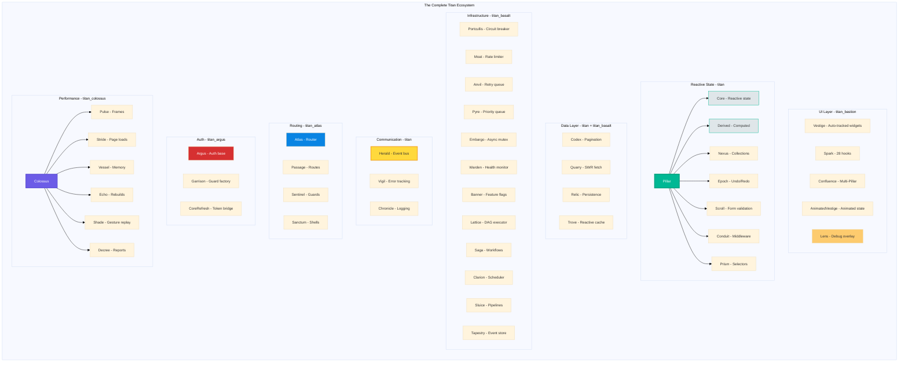

# 🏋️ "5 Problems That Make BLoC Cry in the Shower — And How Titan Solves Them Before Breakfast"

*Real-world scenarios where popular state management solutions wave the white flag, and one mythological framework says "hold my ambrosia."*

---

**TL;DR**: Every state management framework handles a counter. Congratulations, you're all heroes. But what happens when you need reactive pagination + circuit breakers + form validation + undo/redo + cross-feature events in the same feature? BLoC calls in sick. Riverpod files for overtime. GetX pretends it's fine (it's not). Titan was *built* for this.

**Repository**: [github.com/Ikolvi/titan](https://github.com/Ikolvi/titan) · **License**: MIT · **Tests**: 2,277+ · **Benchmarks**: 30 tracked in CI

---

## Let's Be Honest About the State of State Management

Here's a dirty secret the Flutter community doesn't talk about enough:

**Every state management solution demos beautifully on a counter app.**

Increment. Decrement. Behold, the Text widget updates. The crowd goes wild. The Medium article gets 14K claps. The conference talk gets a standing ovation.

Then you ship a real app.

And that's when things get… *spicy*.

You need pagination that plays nice with pull-to-refresh. You need form validation across 12 fields with async uniqueness checks. You need state that persists across app restarts. You need to undo the thing the user just did. You need one feature to react when another feature does something — without creating a spaghetti monster of cross-dependencies. You need a circuit breaker because your backend team's deployment strategy is "YOLO Fridays."

And suddenly, your beloved state management solution is sitting in the corner, rocking back and forth, muttering about `mapEventToState` deprecations.

Let's talk about five *real* problems that make BLoC, Riverpod, Provider, and GetX struggle — and show you how **Titan** handles each one like it was born for this. Because it was.

---

## Problem #1: "The E-Commerce Checkout From Hell"

### The Scenario

You're building a checkout flow. Here's what you need *in a single screen*:

1. A **cart** with reactive totals (items can be added/removed/quantity-changed)
2. **Form validation** across shipping fields (name, address, city, zip — with async zip code verification)
3. A **coupon field** that validates against an API
4. **Persistence** — if the user kills the app mid-checkout, their cart and form data survive
5. An **undo** button that lets them reverse their last action
6. When checkout completes, a **cross-feature event** that tells the inventory system to update

This is not a fantasy. This is *Tuesday* if you work at any company that sells things.

### Architecture At a Glance



```mermaid
%%{init: {'theme': 'base', 'themeVariables': {'fontSize': '14px'}}}%%
graph TB
    subgraph BLOC[" "]
        direction TB
        BT["<b>🧱 BLoC Approach</b><br/>5 packages &bull; 250+ lines &bull; 4 files"]
        CB[CartBloc] --> CE1["CartEvent × 5"]
        CB --> CS["CartState + copyWith📄"]
        CB --> FZ["formz — external pkg"]
        CB --> HB["hydrated_bloc — external pkg"]
        CB --> UndoCustom["Undo — DIY 😬"]
        CB --> EventBusCustom["Event Bus — DIY 😬"]
        FZ --> FI1["FormzInput × 4"]
        HB --> JSON["fromJson / toJson"]
        style BT fill:none,stroke:none,color:#e74c3c,font-size:16px
        style CB fill:#e74c3c,color:#fff,stroke:#c0392b,stroke-width:2px
        style FZ fill:#e67e22,color:#fff
        style HB fill:#e67e22,color:#fff
        style CE1 fill:#ffcccc
        style CS fill:#ffcccc
        style UndoCustom fill:#ffcccc,stroke:#e74c3c,stroke-dasharray: 5
        style EventBusCustom fill:#ffcccc,stroke:#e74c3c,stroke-dasharray: 5
        style FI1 fill:#ffe0cc
        style JSON fill:#ffe0cc
    end

    subgraph TITAN[" "]
        direction TB
        TT["<b>🏛️ Titan Approach</b><br/>0 packages &bull; ~60 lines &bull; 1 file"]
        CP["🏛️ CheckoutPillar"] --> NL["📚 nexusList — Cart"]
        CP --> DR["🔮 derived — Totals"]
        CP --> SC["📝 scroll × 3 — Forms"]
        CP --> SG["✅ scrollGroup — Validity"]
        CP --> RL["🖿 relic — Persistence"]
        CP --> EP["⏪ epoch — Undo"]
        CP --> HR["📨 emit() — Herald"]
        style TT fill:none,stroke:none,color:#00b894,font-size:16px
        style CP fill:#00b894,color:#fff,stroke:#00a381,stroke-width:2px
        style NL fill:#dfe6e9,stroke:#00b894
        style DR fill:#dfe6e9,stroke:#00b894
        style SC fill:#dfe6e9,stroke:#00b894
        style SG fill:#dfe6e9,stroke:#00b894
        style RL fill:#dfe6e9,stroke:#00b894
        style EP fill:#dfe6e9,stroke:#00b894
        style HR fill:#dfe6e9,stroke:#00b894
    end
```

### How BLoC Handles This (Spoiler: Painfully)

```dart
// Step 1: Write a CartEvent hierarchy
abstract class CartEvent {}
class AddItem extends CartEvent { final Product product; AddItem(this.product); }
class RemoveItem extends CartEvent { final int index; RemoveItem(this.index); }
class UpdateQuantity extends CartEvent { final int index; final int qty; UpdateQuantity(this.index, this.qty); }
class ApplyCoupon extends CartEvent { final String code; ApplyCoupon(this.code); }
class SubmitCheckout extends CartEvent {}

// Step 2: Write a CartState (with copyWith, obviously)
class CartState {
  final List<CartItem> items;
  final double total;
  final double discount;
  final String? couponCode;
  final bool isValidatingCoupon;
  final String? couponError;
  final bool isSubmitting;
  final String? submitError;
  // ... a copyWith method the size of a CVS receipt
}

// Step 3: Write the Bloc
class CartBloc extends Bloc<CartEvent, CartState> {
  CartBloc() : super(CartState.initial()) {
    on<AddItem>(_onAdd);
    on<RemoveItem>(_onRemove);
    on<UpdateQuantity>(_onUpdateQty);
    on<ApplyCoupon>(_onApplyCoupon);
    on<SubmitCheckout>(_onSubmit);
  }
  // ... 5 handler methods, each doing emit(state.copyWith(...))
}

// Step 4: Now add form validation — oh wait, BLoC doesn't have that.
// Install `formz`. Write Formz inputs. Write more state fields.

// Step 5: Now add persistence — install `hydrated_bloc`.
// Implement fromJson/toJson for CartState. Pray your serialization works.

// Step 6: Now add undo — find an undo package? Write your own? Cry?

// Step 7: Cross-feature events — inject another Bloc? Use a StreamController?
// Create a shared stream that both Blocs subscribe to?
// Question your career choices?
```

You're now 250+ lines deep, across 4 files, with 3 extra packages, and you haven't written a single widget yet.

**Total packages needed**: `flutter_bloc`, `hydrated_bloc`, `formz`, a custom undo solution, a custom event bus.

### How Titan Handles This (One Pillar, Zero Extra Packages)

```dart
class CheckoutPillar extends Pillar {
  // === Cart (reactive collection — mutate in place, O(1) notifications) ===
  late final items = nexusList<CartItem>([]);
  late final total = derived(
    () => items.fold(0.0, (sum, i) => sum + i.price * i.quantity),
  );

  // === Coupon ===
  late final coupon = core<String?>(null);
  late final couponDiscount = derived(() {
    final c = coupon.value;
    return c != null ? _lookupDiscount(c) : 0.0;
  });
  late final finalTotal = derived(() => total.value - couponDiscount.value);

  // === Form Validation (reactive, with async zip verification) ===
  late final name = scroll<String>(
    validators: [Validators.required('Name is required')],
  );
  late final address = scroll<String>(
    validators: [Validators.required('Address is required')],
  );
  late final zip = scroll<String>(
    validators: [
      Validators.required('Zip is required'),
      Validators.pattern(r'^\d{5}$', 'Must be 5 digits'),
    ],
    asyncValidators: [_verifyZipCode],
  );
  late final form = scrollGroup([name, address, zip]);

  // === Persistence (survives app kill — zero serialization boilerplate) ===
  late final savedCart = relic<List<CartItem>>(
    'checkout_cart',
    adapter: JsonRelicAdapter(
      toJson: (items) => items.map((i) => i.toJson()).toList(),
      fromJson: (json) => (json as List).map((j) => CartItem.fromJson(j)).toList(),
    ),
  );

  // === Undo/Redo (built-in, one line) ===
  late final history = epoch<List<CartItem>>([], maxHistory: 30);

  // === Actions ===
  void addItem(Product p) => strike(() {
    items.add(CartItem.fromProduct(p));
    history.push(List.of(items));
  });

  void removeItem(int index) => strike(() {
    items.removeAt(index);
    history.push(List.of(items));
  });

  void undo() => strike(() {
    history.undo();
    items
      ..clear()
      ..addAll(history.value);
  });

  void applyCoupon(String code) => strike(() => coupon.value = code);

  Future<void> submitCheckout() => strikeAsync(() async {
    if (!form.isValid) return;
    await _processPayment();
    emit(CheckoutCompleted(items: List.of(items)));  // Herald event!
  });
}
```

**That's it.** One file. One class. Zero extra packages.

- Cart with reactive totals? `nexusList` + `derived`.
- Form validation with async zip check? `scroll` + `scrollGroup`.
- Persistence? `relic`.
- Undo? `epoch`.
- Cross-feature events? `emit()` through **Herald**.
- Widgets auto-track only what they read? *Always.*

**Lines**: ~60 vs 250+. **Packages**: 1 vs 5. **Developer sanity**: preserved.

### But Wait, What About the Widgets?

```dart
// In BLoC world:
BlocProvider(
  create: (_) => CartBloc(),
  child: BlocBuilder<CartBloc, CartState>(
    builder: (_, state) {
      // This rebuilds when ANYTHING in state changes.
      // Reading state.total? Cool. State.items changed? REBUILD.
      // Coupon validation finished? REBUILD. Form dirty? REBUILD.
      return Column(
        children: [
          Text('Total: \$${state.total}'),
          Text('Items: ${state.items.length}'),
          // Every Text widget rebuilds when any state changes.
          // Want granular? Wrap each in BlocSelector. Fun.
        ],
      );
    },
  ),
)

// In Titan world:
Beacon(
  pillars: [CheckoutPillar.new],
  child: Column(
    children: [
      // This ONLY rebuilds when finalTotal changes:
      Vestige<CheckoutPillar>(
        builder: (_, c) => Text('Total: \$${c.finalTotal.value}'),
      ),
      // This ONLY rebuilds when items.length changes:
      Vestige<CheckoutPillar>(
        builder: (_, c) => Text('Items: ${c.items.length}'),
      ),
      // Auto-tracked. No selectors. No ceremony.
    ],
  ),
)
```

**BLoC developers**: "I need a `BlocSelector` for every piece of state I read separately."

**Titan developers**: "I just… read it."

---

## Problem #2: "The Real-Time Dashboard That Melts Your Framework"

### The Scenario

You're building an admin dashboard. It shows:

1. A **paginated table** of orders (infinite scroll, 50 items per page)
2. A **live revenue counter** that updates from a WebSocket
3. A **service health monitor** that pings 5 microservices every 30 seconds
4. A **rate limiter** that prevents the user from refreshing data more than 3 times per minute
5. A **circuit breaker** that stops making API calls when the backend is down
6. All of this needs to be **searchable and filterable**

### Architecture At a Glance



```mermaid
%%{init: {'theme': 'base', 'themeVariables': {'fontSize': '14px'}}}%%
graph TB
    subgraph BLOC[" "]
        direction TB
        BT2["<b>🧱 BLoC Dashboard</b><br/>3-4 Blocs &bull; 2-3 custom services &bull; 2+ packages"]
        OLB[OrderListBloc] -.->|"external pkg"| ISP["infinite_scroll_pagination"]
        RB[RevenueBloc] -.->|"external pkg"| WSC["web_socket_channel"]
        HMS["Health Monitor 🛠️"] -.->|"hand-rolled"| Timer1["Timer.periodic"]
        RLS["Rate Limiter 🛠️"] -.->|"hand-rolled"| Timer2["Token bucket DIY"]
        CBX["Circuit Breaker"] -.-> X1["❌ Not available"]
        SFS["Search/Filter 🛠️"] -.->|"hand-rolled"| Stream1["Stream transforms"]
        style BT2 fill:none,stroke:none,color:#e74c3c,font-size:16px
        style OLB fill:#e74c3c,color:#fff
        style RB fill:#e74c3c,color:#fff
        style HMS fill:#ffcccc,stroke:#e74c3c,stroke-dasharray: 5
        style RLS fill:#ffcccc,stroke:#e74c3c,stroke-dasharray: 5
        style SFS fill:#ffcccc,stroke:#e74c3c,stroke-dasharray: 5
        style CBX fill:#ffcccc,stroke:#e74c3c
        style X1 fill:#e74c3c,color:#fff
        style ISP fill:#e67e22,color:#fff
        style WSC fill:#e67e22,color:#fff
    end

    subgraph TITAN2[" "]
        direction TB
        TT2["<b>🏛️ Titan Dashboard</b><br/>1 Pillar &bull; 0 packages &bull; all declarative"]
        DP["🏛️ DashboardPillar"] --> CDX["📖 codex — Pagination"]
        DP --> WDN["🏥 warden — Health × 5"]
        DP --> MT["🏊 moat — Rate Limit"]
        DP --> PC["🏰 portcullis — Breaker"]
        DP --> SV["🔎 sieve — Search"]
        DP --> CV["💚 core — Revenue"]
        style TT2 fill:none,stroke:none,color:#00b894,font-size:16px
        style DP fill:#00b894,color:#fff,stroke:#00a381,stroke-width:2px
        style CDX fill:#dfe6e9,stroke:#00b894
        style WDN fill:#dfe6e9,stroke:#00b894
        style MT fill:#dfe6e9,stroke:#00b894
        style PC fill:#dfe6e9,stroke:#00b894
        style SV fill:#dfe6e9,stroke:#00b894
        style CV fill:#dfe6e9,stroke:#00b894
    end
```

### The BLoC Way (a.k.a. "Package Manager Speed Run")

```
pubspec.yaml:
  flutter_bloc: ^8.1.0
  infinite_scroll_pagination: ^4.0.0
  web_socket_channel: ^2.4.0
  # Health monitoring? Write your own.
  # Rate limiting? Write your own.
  # Circuit breaker? lol
  # Search/filter? Write your own.
```

You'll need:
- **OrderListBloc** with pagination events (`LoadMore`, `Refresh`, `Filter`)
- **RevenueBloc** with a `StreamSubscription` handling WebSocket data
- A hand-rolled health monitoring service with its own state
- A hand-rolled rate limiter (or import a general-purpose one and adapt it)
- A search/filter mechanism that somehow plays nice with pagination
- No circuit breaker because you gave up at this point

Let's count: **3-4 Blocs**, **2-3 custom services**, **2 extra packages**, and approximately **one existential crisis per microservice**.

### The Titan Way (One Pillar Per Concern, All Reactive)

```dart
class DashboardPillar extends Pillar {
  late final orders = codex<Order>(
    fetcher: (request) => api.getOrders(
      page: request.page,
      pageSize: 50,
    ),
  );

  late final revenue = core(0.0);

  late final health = warden(
    interval: Duration(seconds: 30),
    services: [
      WardenService(name: 'payments', check: () => api.ping('/payments')),
      WardenService(name: 'inventory', check: () => api.ping('/inventory')),
      WardenService(name: 'shipping', check: () => api.ping('/shipping')),
      WardenService(name: 'users', check: () => api.ping('/users')),
      WardenService(name: 'analytics', check: () => api.ping('/analytics')),
    ],
  );

  late final refreshLimiter = moat(
    maxTokens: 3,
    refillInterval: Duration(minutes: 1),
  );

  late final apiBreaker = portcullis(
    failureThreshold: 5,
    resetTimeout: Duration(seconds: 30),
  );

  late final search = sieve<Order>(
    items: () => orders.items,
    filter: (order, query) =>
      order.customerName.toLowerCase().contains(query.toLowerCase()),
  );

  @override
  void onInit() {
    // WebSocket revenue stream — auto-tracked
    watch(() {
      final ws = WebSocketChannel.connect(Uri.parse('wss://api/revenue'));
      ws.stream.listen((data) {
        strike(() => revenue.value = double.parse(data));
      });
    });
  }

  Future<void> refreshOrders() async {
    if (!refreshLimiter.tryConsume()) {
      log.warn('Rate limited — slow down, dashboard warrior');
      return;
    }
    await apiBreaker.execute(() => orders.refresh());
  }
}
```

Let's count what Titan gave you **out of the box**:

| Feature | BLoC Approach | Titan Primitive |
|---------|---------------|-----------------|
| Pagination | Write it yourself + package | **Codex** (1 line) |
| Health monitoring | Write it yourself | **Warden** (1 declaration) |
| Rate limiting | Write it yourself | **Moat** (1 declaration) |
| Circuit breaker | You won't | **Portcullis** (1 declaration) |
| Search/filter | Write it yourself | **Sieve** (1 declaration) |
| WebSocket state | StreamSubscription + Bloc | `core` + `watch` |

**Total external packages for Titan**: 0. **Total for BLoC**: "How many are on pub.dev?"

---

## Problem #3: "The Form From Mordor"

### The Scenario

You're building a multi-step registration form:

1. **Step 1**: Email (async uniqueness check), password (strength meter), confirm password (must match)
2. **Step 2**: First name, last name, phone (format validation), date of birth
3. **Step 3**: Address, city, state (dropdown), zip (async verification)
4. Each step has a **dirty indicator** and shows errors **only after touch**
5. The entire form has a **global validity** state
6. If the user navigates away and comes back, **form state persists**
7. The user can **undo** their last change in any field

That's 11 validated fields, 3 async validators, touched/dirty tracking per field, grouped validity per step, global validity, persistence, and undo.

### Architecture At a Glance



```mermaid
%%{init: {'theme': 'base', 'themeVariables': {'fontSize': '14px'}}}%%
graph TB
    subgraph BLOC3[" "]
        direction TB
        BT3["<b>🧱 BLoC + Formz</b><br/>400-500 lines 😵"]
        RB[RegistrationBloc] --> EV["Events × 11+"]
        RB --> RS["RegistrationState"]
        RS --> CW["copyWith() — 25 params 📄"]
        RS --> FI["FormzInput × 11"]
        FI --> V1["EmailInput"]
        FI --> V2["PasswordInput"]
        FI --> V3["PhoneInput"]
        FI --> VN["... 8 more"]
        RS --> T["touched booleans × 11"]
        RS --> D["dirty booleans × 11"]
        RB -.-> UNDO["❌ Undo — Not available"]
        RB -.-> PERSIST["❌ Persist — Not available"]
        style BT3 fill:none,stroke:none,color:#e74c3c,font-size:16px
        style RB fill:#e74c3c,color:#fff,stroke:#c0392b,stroke-width:2px
        style RS fill:#ffcccc
        style CW fill:#ffcccc
        style EV fill:#ffcccc
        style FI fill:#ffcccc
        style UNDO fill:#e74c3c,color:#fff
        style PERSIST fill:#e74c3c,color:#fff
    end

    subgraph TITAN3[" "]
        direction TB
        TT3["<b>🏛️ Titan Scroll</b><br/>~80 lines 🎉"]
        RP["🏛️ RegistrationPillar"] --> S1["📝 scroll × 11"]
        S1 --> AUTO1["✅ Auto dirty tracking"]
        S1 --> AUTO2["✅ Auto touch tracking"]
        S1 --> AUTO3["✅ Async validators"]
        RP --> G1["📁 scrollGroup — Step 1"]
        RP --> G2["📁 scrollGroup — Step 2"]
        RP --> G3["📁 scrollGroup — Step 3"]
        RP --> GA["📁 scrollGroup — All Steps"]
        RP --> EPO["⏪ epoch — Undo"]
        RP --> REL["🖿 relic — Persistence"]
        style TT3 fill:none,stroke:none,color:#00b894,font-size:16px
        style RP fill:#00b894,color:#fff,stroke:#00a381,stroke-width:2px
        style S1 fill:#dfe6e9,stroke:#00b894
        style AUTO1 fill:#a8e6cf,stroke:#00b894
        style AUTO2 fill:#a8e6cf,stroke:#00b894
        style AUTO3 fill:#a8e6cf,stroke:#00b894
        style G1 fill:#dfe6e9,stroke:#00b894
        style G2 fill:#dfe6e9,stroke:#00b894
        style G3 fill:#dfe6e9,stroke:#00b894
        style GA fill:#dfe6e9,stroke:#00b894
        style EPO fill:#dfe6e9,stroke:#00b894
        style REL fill:#dfe6e9,stroke:#00b894
    end
```

### BLoC + Formz (a.k.a. "Boilerplate: The Musical")

With `formz`, every validated field needs:
- A `FormzInput` subclass (with `validator` override)
- State properties for each field's value, error, and touched state
- A `copyWith` for every field change
- Events for each field change, blur, and submit

For 11 fields, that's:
- **11 FormzInput subclasses** (~8 lines each = 88 lines)
- **1 massive state class** with 11 field values, 11 touched booleans, loading state, step index (~60 lines + a `copyWith` the size of a novella)
- **11+ events** (one per field change, plus blur, plus submit, plus step navigation)
- **11 event handlers** in the Bloc

Conservative estimate: **400-500 lines** of pure form infrastructure. Before a single widget.

You know what's missing from all that? **Undo. Persistence. Async validators that don't race-condition.** Have fun adding those!

### Titan's Scroll + ScrollGroup

```dart
class RegistrationPillar extends Pillar {
  // === Step 1 ===
  late final email = scroll<String>(
    validators: [
      Validators.required('Email is required'),
      Validators.email('Invalid email'),
    ],
    asyncValidators: [
      (value) async {
        final taken = await api.isEmailTaken(value);
        return taken ? 'Email already in use' : null;
      },
    ],
  );
  late final password = scroll<String>(
    validators: [
      Validators.required('Password is required'),
      Validators.minLength(8, 'Must be at least 8 characters'),
    ],
  );
  late final confirmPassword = scroll<String>(
    validators: [
      Validators.required('Please confirm password'),
      (value) => value != password.value ? 'Passwords do not match' : null,
    ],
  );

  // === Step 2 ===
  late final firstName = scroll<String>(
    validators: [Validators.required('First name is required')],
  );
  late final lastName = scroll<String>(
    validators: [Validators.required('Last name is required')],
  );
  late final phone = scroll<String>(
    validators: [
      Validators.required('Phone is required'),
      Validators.pattern(r'^\+?[\d\-\s]{10,}$', 'Invalid phone number'),
    ],
  );
  late final dob = scroll<DateTime?>(validators: [
    (value) => value == null ? 'Date of birth is required' : null,
  ]);

  // === Step 3 ===
  late final address = scroll<String>(
    validators: [Validators.required('Address is required')],
  );
  late final city = scroll<String>(
    validators: [Validators.required('City is required')],
  );
  late final state = scroll<String>(
    validators: [Validators.required('State is required')],
  );
  late final zip = scroll<String>(
    validators: [
      Validators.required('Zip is required'),
      Validators.pattern(r'^\d{5}$', 'Must be 5 digits'),
    ],
    asyncValidators: [_verifyZipCode],
  );

  // === Groups (reactive per-step and global validity) ===
  late final step1 = scrollGroup([email, password, confirmPassword]);
  late final step2 = scrollGroup([firstName, lastName, phone, dob]);
  late final step3 = scrollGroup([address, city, state, zip]);
  late final allSteps = scrollGroup([
    email, password, confirmPassword, firstName, lastName,
    phone, dob, address, city, state, zip,
  ]);

  // === Step Navigation ===
  late final currentStep = core(0);

  // === Persistence (form survives app kill) ===
  late final savedForm = relic<Map<String, dynamic>>(
    'registration_form',
    adapter: JsonRelicAdapter.identity(),
  );

  // === Undo ===
  late final formHistory = epoch<Map<String, dynamic>>({}, maxHistory: 50);

  // === Derived ===
  late final canProceed = derived(() {
    return switch (currentStep.value) {
      0 => step1.isValid,
      1 => step2.isValid,
      2 => step3.isValid,
      _ => false,
    };
  });

  void nextStep() => strike(() {
    if (canProceed.value && currentStep.value < 2) {
      currentStep.value++;
    }
  });

  void previousStep() => strike(() {
    if (currentStep.value > 0) currentStep.value--;
  });
}
```

**What you just got — for free:**

- Dirty tracking per field (`.isDirty`)
- Touch tracking per field (`.isTouched`)
- Errors shown only after touch (standard UX pattern)
- Per-step validity (`step1.isValid`, `step2.isValid`)
- Global validity (`allSteps.isValid`)
- Async validators that debounce automatically
- Persistence
- Undo
- Zero extra packages

**What BLoC + Formz gave you**: A `copyWith` method longer than this article and a prayer that your async validators don't fire simultaneously.

### The Widget Difference

```dart
// BLoC: You need to manually wire up EVERY field to its error state
BlocBuilder<RegistrationBloc, RegistrationState>(
  builder: (_, state) => TextField(
    onChanged: (v) => context.read<RegistrationBloc>().add(EmailChanged(v)),
    decoration: InputDecoration(
      errorText: state.email.displayError?.toString(),
    ),
  ),
)

// Titan: Scroll knows its own state
Vestige<RegistrationPillar>(
  builder: (_, p) => TextField(
    onChanged: (v) => p.email.value = v,
    decoration: InputDecoration(
      errorText: p.email.isTouched ? p.email.error : null,
    ),
  ),
)
```

One reads like tax law. The other reads like code.

---

## Problem #4: "The Feature That Needs to Talk to Five Other Features"

### The Scenario

You're building a social media app. When a user **likes a post**:

1. The **post's like count** increments
2. The **user's liked posts list** updates
3. The **notification system** sends a push to the post author
4. The **analytics feature** tracks the engagement event
5. The **feed algorithm** adjusts the post's ranking score
6. The **achievement system** checks if the user earned the "100 Likes Given" badge

Six features need to react to one user tap. Welcome to real-world software engineering.

### Architecture At a Glance



```mermaid
%%{init: {'theme': 'base', 'themeVariables': {'fontSize': '14px'}}}%%
graph TB
    subgraph BLOC4[" "]
        direction TB
        BT4["<b>🧱 BLoC — Tight Coupling</b><br/>Every feature knows every other feature"]
        PB["PostBloc"] ==>|"imports"| UB["UserBloc"]
        PB ==>|"imports"| NB["NotificationBloc"]
        PB ==>|"imports"| AB["AnalyticsBloc"]
        PB ==>|"imports"| FB["FeedBloc"]
        PB ==>|"imports"| AchB["AchievementBloc"]
        UB -.->|"subscribes"| PB
        NB -.->|"subscribes"| PB
        GOD["🍝 Result: God Object<br/>5 constructor deps<br/>Untestable in isolation"]
        style BT4 fill:none,stroke:none,color:#e74c3c,font-size:16px
        style PB fill:#e74c3c,color:#fff,stroke:#c0392b,stroke-width:3px
        style UB fill:#ffcccc,stroke:#e74c3c
        style NB fill:#ffcccc,stroke:#e74c3c
        style AB fill:#ffcccc,stroke:#e74c3c
        style FB fill:#ffcccc,stroke:#e74c3c
        style AchB fill:#ffcccc,stroke:#e74c3c
        style GOD fill:#e74c3c,color:#fff,stroke-dasharray: 5
    end

    subgraph TITAN4[" "]
        direction TB
        TT4["<b>🏛️ Titan — Zero Coupling</b><br/>Features communicate through Herald events"]
        PP["🏛️ PostPillar"] -->|"emit(PostLiked)"| HE{{"📯 Herald<br/>Event Bus"}}
        HE -->|"listen&lt;PostLiked&gt;"| UP["🏛️ UserPillar"]
        HE -->|"listen&lt;PostLiked&gt;"| NP["🏛️ NotificationPillar"]
        HE -->|"listen&lt;PostLiked&gt;"| AP["🏛️ AnalyticsPillar"]
        HE -->|"listen&lt;PostLiked&gt;"| FP["🏛️ FeedPillar"]
        HE -->|"listen&lt;PostLiked&gt;"| AchP["🏛️ AchievementPillar"]
        HE -.->|"Just add listen()"| NEW["✨ NewPillar ✅"]
        style TT4 fill:none,stroke:none,color:#00b894,font-size:16px
        style PP fill:#00b894,color:#fff,stroke:#00a381,stroke-width:2px
        style HE fill:#ffd93d,color:#333,stroke:#f39c12,stroke-width:3px
        style UP fill:#dfe6e9,stroke:#00b894
        style NP fill:#dfe6e9,stroke:#00b894
        style AP fill:#dfe6e9,stroke:#00b894
        style FP fill:#dfe6e9,stroke:#00b894
        style AchP fill:#dfe6e9,stroke:#00b894
        style NEW fill:#a8e6cf,stroke:#00b894,stroke-dasharray: 5
    end
```

> **Left**: Every BLoC directly references every other BLoC. Adding or removing a feature means changing `PostBloc`'s constructor.
>
> **Right**: Pillars talk through **Herald** — a type-safe event bus. PostPillar emits an event and has *zero knowledge* of who's listening. Add a 7th feature with one `listen()` call. Nothing else changes.

### The BLoC Way: Choose Your Pain

**Option A: Direct Injection (Spaghetti)**

```dart
class PostBloc extends Bloc<PostEvent, PostState> {
  final UserBloc userBloc;
  final NotificationBloc notificationBloc;
  final AnalyticsBloc analyticsBloc;
  final FeedBloc feedBloc;
  final AchievementBloc achievementBloc;

  // Every Bloc knows about every other Bloc.
  // Add a new feature? Update 5 constructor signatures.
  // Remove a feature? Same.
  // Testing? Mock 5 dependencies per test.

  PostBloc({
    required this.userBloc,
    required this.notificationBloc,
    required this.analyticsBloc,
    required this.feedBloc,
    required this.achievementBloc,
  }) : super(PostState.initial()) {
    on<LikePost>((event, emit) {
      emit(state.copyWith(/* increment like */));
      userBloc.add(AddLikedPost(event.postId));
      notificationBloc.add(SendLikeNotification(event.postId));
      analyticsBloc.add(TrackEngagement('like', event.postId));
      feedBloc.add(AdjustRanking(event.postId, boost: 1.0));
      achievementBloc.add(CheckLikeAchievement());
    });
  }
}
```

Your `PostBloc` now has **five dependencies**. It knows about notifications, analytics, feeds, achievements, and user state. It's basically a God Object wearing a trench coat pretending to be a separation of concerns.

**Option B: Stream Subscriptions (Silent Nightmares)**

```dart
class UserBloc extends Bloc<UserEvent, UserState> {
  late final StreamSubscription _postSub;

  UserBloc(PostBloc postBloc) : super(UserState.initial()) {
    _postSub = postBloc.stream.listen((state) {
      // You receive the ENTIRE state on every change.
      // Was it a like? A comment? A delete? An edit?
      // You have to figure it out yourself.
      // Good luck.
    });
  }
}
// Repeat for 4 more Blocs. Each subscribing to PostBloc.
// Each trying to diff the entire state object to figure out what happened.
// Each with a StreamSubscription that might leak if you forget to cancel it.
```

**Option C: Accept The Chaos**

```dart
// Just put everything in one mega-Bloc.
// It handles posts, users, notifications, analytics, feed ranking,
// and achievements. It's 900 lines. It works. Nobody can maintain it.
// But it works. Mostly.
```

### The Titan Way: Herald (Zero Coupling)

```dart
// === PostPillar: knows NOTHING about other features ===
class PostPillar extends Pillar {
  late final posts = nexusList<Post>([]);

  void likePost(String postId) => strike(() {
    final post = posts.firstWhere((p) => p.id == postId);
    post.likes++;
    posts.notify();  // Trigger listeners

    // Emit a Herald event. That's it. Done. Goodbye.
    emit(PostLiked(postId: postId, userId: currentUserId));
  });
}

// === UserPillar: listens for likes ===
class UserPillar extends Pillar {
  late final likedPosts = nexusList<String>([]);

  @override
  void onInit() {
    listen<PostLiked>((event) {
      likedPosts.add(event.postId);
    });
  }
}

// === NotificationPillar: listens for likes ===
class NotificationPillar extends Pillar {
  @override
  void onInit() {
    listen<PostLiked>((event) {
      _sendPushNotification(event.postId);
    });
  }
}

// === AnalyticsPillar: listens for likes ===
class AnalyticsPillar extends Pillar {
  @override
  void onInit() {
    listen<PostLiked>((event) {
      _trackEngagement('like', event.postId);
    });
  }
}

// === FeedPillar: listens for likes ===
class FeedPillar extends Pillar {
  @override
  void onInit() {
    listen<PostLiked>((event) {
      _boostRanking(event.postId, 1.0);
    });
  }
}

// === AchievementPillar: listens for likes ===
class AchievementPillar extends Pillar {
  late final likesGiven = core(0);

  @override
  void onInit() {
    listen<PostLiked>((event) {
      strike(() => likesGiven.value++);
      if (likesGiven.value == 100) {
        emit(AchievementUnlocked(badge: 'Century Liker'));
      }
    });
  }
}
```

**What changed?**

- `PostPillar` has **zero** dependencies on other features. It does its job and emits an event.
- Each feature **independently** listens for events it cares about.
- Want to add a 7th feature that reacts to likes? Add one `listen<PostLiked>(...)` call. **Nothing else changes.**
- Want to remove analytics? Delete `AnalyticsPillar`. **Nothing else changes.**
- Testing? Test each Pillar in isolation. Emit the event, assert the behavior. No mocks needed.

This is the **Herald** pattern. It's a built-in, type-safe event bus that participates in the Pillar lifecycle. Events are automatically cleaned up when Pillars dispose.

Here's the kicker: **BLoC is literally named after "Business Logic Component" — a pattern that promotes separation of concerns.** And yet, the moment you need features to communicate, BLoC forces them to know about each other. Herald doesn't.

---

## Problem #5: "Production Went Down at 3 AM and Nobody Knows Why"

### The Scenario

Your app is in production. Users are reporting:

1. Random **blank screens** (something rendered, then crashed, but the error was swallowed)
2. **Slow scrolling** in the orders list (too many rebuilds? memory leak? who knows?)
3. The **submit button** sometimes fires **twice** (race condition in async handlers)
4. A specific **API endpoint** keeps failing, but the app retries infinitely (no backoff, no circuit breaking)
5. The **last 3 deploys** introduced performance regressions, but nobody noticed until users complained

This is not a "state management problem" in the traditional sense. But it's *absolutely* a state management problem, because your state management solution is the foundation of your app. If it doesn't help you debug, monitor, and protect production — it's just a fancy `setState` with extra steps.

### Architecture At a Glance



```mermaid
%%{init: {'theme': 'base', 'themeVariables': {'fontSize': '14px'}}}%%
graph TB
    subgraph BLOC5[" "]
        direction TB
        BT5["<b>🧱 BLoC Production Toolkit</b><br/>2 callbacks. That's the whole toolkit."]
        BO["BlocObserver"] --> LOG1["onChange → print()"]
        BO --> LOG2["onError → print()"]
        BO -.-> WALL{" "}
        WALL -.-> MISS1["❌ Frame monitoring"]
        WALL -.-> MISS2["❌ Memory tracking"]
        WALL -.-> MISS3["❌ Circuit breaker"]
        WALL -.-> MISS4["❌ Rate limiting"]
        WALL -.-> MISS5["❌ Retry + backoff"]
        WALL -.-> MISS6["❌ Rebuild counting"]
        WALL -.-> MISS7["❌ Gesture replay"]
        WALL -.-> MISS8["❌ Perf reports"]
        style BT5 fill:none,stroke:none,color:#e74c3c,font-size:16px
        style BO fill:#e74c3c,color:#fff,stroke:#c0392b,stroke-width:2px
        style WALL fill:none,stroke:none
        style MISS1 fill:#ffcccc,stroke:#e74c3c
        style MISS2 fill:#ffcccc,stroke:#e74c3c
        style MISS3 fill:#ffcccc,stroke:#e74c3c
        style MISS4 fill:#ffcccc,stroke:#e74c3c
        style MISS5 fill:#ffcccc,stroke:#e74c3c
        style MISS6 fill:#ffcccc,stroke:#e74c3c
        style MISS7 fill:#ffcccc,stroke:#e74c3c
        style MISS8 fill:#ffcccc,stroke:#e74c3c
    end

    subgraph TITAN5[" "]
        direction TB
        TT5["<b>🏛️ Titan Production Arsenal</b><br/>14 built-in production primitives"]

        TP["🏛️ Your Pillar"] --> VG["🛡️ Vigil — Error Tracking"]
        TP --> CH["📜 Chronicle — Structured Logging"]
        TP --> PC["🏰 Portcullis — Circuit Breaker"]
        TP --> MT["🏊 Moat — Rate Limiting"]
        TP --> AN["⚒️ Anvil — Retry with Backoff"]

        CL["🟣 Colossus"] --> PL["💓 Pulse — Frame Monitor"]
        CL --> STR["🏃 Stride — Page Load Timing"]
        CL --> VS["🧠 Vessel — Memory Monitor"]
        CL --> EC["🔁 Echo — Rebuild Counter"]
        CL --> SH["👤 Shade — Gesture Record & Replay"]
        CL --> DC["📊 Decree + Inscribe — Reports"]

        LN["🔍 Lens"] --> OV["4-Tab Live Debug Overlay"]

        style TT5 fill:none,stroke:none,color:#00b894,font-size:16px
        style TP fill:#00b894,color:#fff,stroke:#00a381,stroke-width:2px
        style CL fill:#6c5ce7,color:#fff,stroke:#5b4fcf,stroke-width:2px
        style LN fill:#fdcb6e,color:#333,stroke:#f39c12,stroke-width:2px
        style VG fill:#dfe6e9,stroke:#00b894
        style CH fill:#dfe6e9,stroke:#00b894
        style PC fill:#dfe6e9,stroke:#00b894
        style MT fill:#dfe6e9,stroke:#00b894
        style AN fill:#dfe6e9,stroke:#00b894
        style PL fill:#dfe6e9,stroke:#6c5ce7
        style STR fill:#dfe6e9,stroke:#6c5ce7
        style VS fill:#dfe6e9,stroke:#6c5ce7
        style EC fill:#dfe6e9,stroke:#6c5ce7
        style SH fill:#dfe6e9,stroke:#6c5ce7
        style DC fill:#dfe6e9,stroke:#6c5ce7
        style OV fill:#ffeaa7,stroke:#f39c12
    end
```

### What BLoC Gives You

```dart
class MyBlocObserver extends BlocObserver {
  @override
  void onChange(BlocBase bloc, Change change) {
    // You get: the bloc type and "a change happened."
    // What changed? You see the entire previous and current state.
    // Useful for logs. Not useful for debugging performance.
    print('${bloc.runtimeType} $change');
  }

  @override
  void onError(BlocBase bloc, Object error, StackTrace stackTrace) {
    // You get the error. Good.
    // What happens next? You decide. BLoC doesn't care.
    print('Error in ${bloc.runtimeType}: $error');
  }
}
```

That's… it. No frame monitoring. No rebuild counting. No memory tracking. No circuit breaking. No rate limiting. No structured error severity. No production alerting. No performance regression detection.

### What Riverpod Gives You

Less than BLoC, honestly. `ProviderObserver` gives you lifecycle events, but no performance tooling, no error aggregation, no production monitoring.

### What GetX Gives You

A log statement that says "GETX: Instance deleted" and a strong sense of optimism.

### What Titan Gives You: The Full Arsenal

```dart
class ProductionPillar extends Pillar {
  // === Error Tracking with Severity (Vigil) ===
  void riskyOperation() {
    try {
      dangerousApiCall();
    } catch (e, stack) {
      captureError(e, stack);  // Routed to Vigil
      // Vigil aggregates errors, tracks frequency, and exposes
      // error streams for monitoring dashboards
    }
  }

  // === Structured Logging (Chronicle) ===
  void processOrder(Order order) {
    log.info('Processing order ${order.id}');
    // log.warn(), log.error(), log.debug() — all reactive,
    // all filterable, all structured
  }

  // === Circuit Breaker (Portcullis) ===
  late final apiBreaker = portcullis(
    failureThreshold: 5,         // Open after 5 failures
    resetTimeout: Duration(seconds: 30), // Try again in 30s
  );

  Future<Data> fetchSafely() async {
    return apiBreaker.execute(() => api.getData());
    // After 5 failures: throws PortcullisOpenException
    // After 30s: allows one test request (half-open)
    // If test succeeds: circuit closes, normal operation resumes
    // All reactive — your UI can show "API unavailable" automatically
  }

  // === Rate Limiting (Moat) ===
  late final submitLimiter = moat(maxTokens: 1, refillInterval: Duration(seconds: 3));

  Future<void> submitForm() async {
    if (!submitLimiter.tryConsume()) {
      log.warn('Double-submit prevented');
      return;
    }
    await _actualSubmit();
  }

  // === Retry Queue with Backoff (Anvil) ===
  late final retryQueue = anvil<ApiRequest>(
    processor: (request) => api.send(request),
    backoff: AnvilBackoff.exponential(
      initial: Duration(seconds: 1),
      max: Duration(seconds: 60),
    ),
    maxRetries: 5,
  );
}
```

And on the **Flutter side**, for visual performance monitoring:

```dart
// Drop this anywhere in your widget tree:
Colossus(
  child: MyApp(),
)

// Now you have:
// - Pulse: Frame rate monitoring (jank detection)
// - Stride: Page load time tracking
// - Vessel: Memory usage monitoring
// - Echo: Widget rebuild counting per component
// - Tremor: Performance alerts when metrics exceed thresholds
// - Decree: Exportable performance reports
// - Shade: Gesture recording & replay for bug reproduction

// Want a visual overlay? Add Lens:
Lens(child: MyApp())
// Draggable 4-tab debug panel showing ALL reactive state, live.
```

### The Production Comparison Table

| Production Need | BLoC | Riverpod | GetX | Titan |
|----------------|------|----------|------|-------|
| Error tracking with severity | `onError` callback | `ProviderObserver` | ❌ | **Vigil** (built-in) |
| Structured logging | ❌ (use `print`) | ❌ | ❌ | **Chronicle** (built-in) |
| Circuit breaker | ❌ | ❌ | ❌ | **Portcullis** (built-in) |
| Rate limiting | ❌ | ❌ | ❌ | **Moat** (built-in) |
| Retry with backoff | ❌ | ❌ | ❌ | **Anvil** (built-in) |
| Frame monitoring | ❌ | ❌ | ❌ | **Pulse** (built-in) |
| Memory monitoring | ❌ | ❌ | ❌ | **Vessel** (built-in) |
| Rebuild counting | ❌ | ❌ | ❌ | **Echo** (built-in) |
| Gesture recording | ❌ | ❌ | ❌ | **Shade** (built-in) |
| Performance reports | ❌ | ❌ | ❌ | **Decree** + **Inscribe** |
| Debug overlay | `BlocObserver` (logs) | ❌ | ❌ | **Lens** (visual panel) |

**Titan isn't just a state management library.** It's the production infrastructure layer your app needs to survive contact with real users.

---

## "But Isn't Titan Just Doing Too Much?"

I hear you. "Separation of concerns! Single responsibility! A state management library shouldn't do pagination!"

Counter-argument: **Every Flutter app needs state management AND pagination AND form validation AND error tracking AND persistence.** You either get them from one integrated, tested, reactive system — or you play Frankenstein with 8 packages from 8 authors with 8 different update cycles and 8 different bug trackers.

Titan has 2,277+ tests. The reactive engine runs at sub-microsecond latency, verified by 30 benchmarks on every commit. Every feature integrates with the same auto-tracking system, so your widgets always know exactly what to rebuild.

Is that "too much"? Or is it *exactly the right amount?*

---

## The Full Picture



> Every box above is a **built-in Titan primitive**. No external packages. No glue code. All reactive. All auto-disposing.

---

## The Final Score

Let's tally the damage across all 5 problems:

| Metric | BLoC + Ecosystem | Titan |
|--------|-----------------|-------|
| External packages needed | 8-12 | 0 |
| Lines of boilerplate infrastructure | 1,000+ | ~200 |
| Features you had to hand-roll | 15+ | 0 |
| Features that "just work" via declaration | 0 | 20+ |
| Time debugging cross-feature coupling | Yes | No |
| Production monitoring capability | Logs | Full telemetry |
| Time spent writing `copyWith` | Incalculable | 0 |
| Developer happiness | "It's fine. This is fine." | "Wait, that's *it?*" |

---

## Getting Started (It Takes 30 Seconds)

```yaml
# pubspec.yaml
dependencies:
  titan: ^1.0.0
  titan_basalt: ^1.0.0    # Infrastructure (Trove, Moat, Portcullis, etc.)
  titan_bastion: ^1.0.0   # Flutter widgets (Vestige, Beacon, Spark)
  titan_atlas: ^1.0.0     # Routing (if needed)
  titan_argus: ^1.0.0     # Auth (if needed)
  titan_colossus: ^1.0.0  # Performance monitoring (if needed)
```

```dart
// Your first Pillar
class CounterPillar extends Pillar {
  late final count = core(0);
  void increment() => strike(() => count.value++);
}

// Your first widget
Beacon(
  pillars: [CounterPillar.new],
  child: Vestige<CounterPillar>(
    builder: (_, c) => ElevatedButton(
      onPressed: () => c.increment(),
      child: Text('Count: ${c.count.value}'),
    ),
  ),
)
```

That's a reactive, auto-tracked, auto-disposing counter in 12 lines. Now scale it to an enterprise app without changing the pattern.

---

## One More Thing…

All those components with mythology names? They're not just branding. They form a vocabulary that tells you *exactly* what something does:

- See a **Portcullis**? It defends against cascading failures.
- See a **Herald**? It carries messages between features.
- See an **Anvil**? It hammers retries until they succeed.
- See a **Moat**? It limits how fast things can cross.
- See an **Epoch**? It remembers the past (and can go back to it).
- See a **Vigil**? It watches for danger.

Once you learn the names, you read Titan code like a story. And stories are a lot easier to maintain than `MyFeatureBloc<MyFeatureEvent, MyFeatureState>`.

---

## Links

- **GitHub**: [github.com/Ikolvi/titan](https://github.com/Ikolvi/titan)
- **Migration Guide**: See `docs/10-migration-guide.md` for step-by-step BLoC/Riverpod/GetX migration
- **Tutorial**: The Chronicles of Titan — a 30+ chapter narrative tutorial in `docs/story/`
- **License**: MIT (free as in beer, free as in freedom, free as in "no really, it's free")

---

*Titan. Because your app deserves more than a counter demo.*

*Built by [Ikolvi](https://ikolvi.com). Tested by 2,277+ tests. Benchmarked on every commit. Named after gods.*

---

**Coming up next**: *"The Chronicles of Titan: Chapter 1 — The First Pillar"* — where a developer named Kael discovers a framework that doesn't make them want to quit tech.
